# Entity Relationship Diagram

> Derived directly from the live Access database (`Mc2526.mdb`). All table and column names are exact.

## Core Data Model

```mermaid
erDiagram
    tblMastCompany ||--o{ tblMastAccount : "has accounts"
    tblMastGroup ||--o{ tblMastAccount : "classifies via AgCode"
    tblMastAccount ||--o{ tblVoucher : "VAcCode / VAcOCode"
    tblMastAccount ||--o{ tblOutStanding : "OutAcCode"
    tblMastAccount ||--o{ tblOutStanding : "OutBrokerCode"
    tblMastNarration ||--o{ tblVoucher : "tax narration"
    tblMastItem ||--o{ tblvousub : "VSubItCode"
    tblVoucher ||--o{ tblvousub : "VNo+VType+VYear"
    tblVoucher ||--o{ tblAddLess : "VNo+VType+VYear"
    tblVoucher ||--o{ tblOutStanding : "creates outstanding"
    tblVoucher ||--o{ tblRecVsSale : "receipt matched to invoice"
    tblVoucher ||--o{ tblConfirmation : "sales confirmation"
    tblVoucher ||--o{ tbleInvoiceIRN : "e-invoice IRN"
    tblvousub ||--o{ tblBags : "InwNo+InwType / GPNo+GpType"
    tblvousub ||--o{ tblGpSub : "gate pass line items"
    tblVoucher ||--o{ tblTDS : "VNo+VYear"
    tblVoucher ||--o{ tblMillRecPay : "mill receipt/payment"
    tblMastUser ||--o{ tblUserPrevilage : "UserName"

    tblMastCompany {
        Int     CompCode PK
        WChar   cName
        WChar   CAdd1
        WChar   CAdd2
        WChar   CPan
        WChar   CGSTIN
        WChar   CBankName
        WChar   CBankAcNo
    }

    tblMastGroup {
        Int     AgCode PK
        WChar   AgName
        Int     GpCode
        Int     TopGroup
        Int     IsFixGroup
        WChar   Schedule
    }

    tblMastAccount {
        Int     AcCode PK
        WChar   AcName
        WChar   AcAlName
        Int     AgCode FK
        Int     AgCode1
        Int     AcBrkCode
        WChar   AcGSTIN
        WChar   AcPAN
        WChar   AcState
        WChar   AcStateCode
        Decimal AcIntPer
        Decimal AcOSLimit
        SmallInt AcIsTDSPay
        WChar   AcTDSNature
        Int     AcMillType
        WChar   AcPartyBank
        WChar   AcPartyIFSC
    }

    tblMastItem {
        Int     ItCode PK
        WChar   ItName
        WChar   ItShort
        WChar   ItUnit
        WChar   ItTicket
        Decimal ItCGSTRt
        Decimal ItSGSTRt
        Decimal ItIGSTRt
        Decimal ItBrokRt
        Int     ItMillCode
        Int     ItType
    }

    tblMastNarration {
        Int     NarrCode PK
        WChar   Narration
        WChar   NarrType
        Int     MastTaxPurAcCode
        Int     MastTaxSAAcCode
        Decimal MastTaxRate
        Decimal CGSTPayAc
        Decimal SGSTPayAc
        Decimal IGSTPayAc
        Decimal CGSTInPutAc
        Decimal SGSTInPutAc
        Decimal IGSTInPutAc
        Int     RCMPayAc
        WChar   GSTIN
    }

    tblMastSetting {
        Int     AcCodeSY
        Int     AcCodeST
        Int     AcCodePY
        Int     AcCodePT
        Int     TaxCodeSY
        Int     TaxCodeSO
        Int     TaxCodeSD
        Int     TaxCodeST
        Int     TaxCodeSM
        Int     TaxCodePY
        Int     TaxCodePT
        Int     LatePayIntAcCode
        Int     BillDbNtAcCode
        Int     TDSAcCode
        Int     TDSPaidAcCode
        Int     BrokerageAcCode
        Int     BankCommAcCode
        Int     AcCodeTcsPay
        Int     AcCodeTcsRec
    }

    tblVoucher {
        Int     VNo PK
        WChar   VType PK
        SmallInt VYear PK
        SmallInt VCtrNo PK
        Date    VDt
        Int     VAcCode FK
        Int     VAcOCode FK
        Decimal VAmt
        WChar   VBillNo
        Date    VBillDt
        Int     Vbroker FK
        Decimal VTaxableAmt
        Decimal VCGSTRt
        Decimal VCGSTAmt
        Decimal VSGSTRt
        Decimal VSGSTAmt
        Decimal VIGSTRt
        Decimal VIGSTAmt
        WChar   VHsn
        WChar   VIrnNo
        WChar   VAckNo
        SmallInt VIsRefEntType
        Int     VIsGSTEntry
        Int     VIsAudited
        WChar   VNar1
        WChar   VNar2
        WChar   VNar3
        WChar   VNar4
        WChar   VUserName
        Date    VReconDt
        WChar   VEntStatus
    }

    tblvousub {
        Int     VNo PK
        WChar   VType PK
        SmallInt VYear PK
        SmallInt VSubCtrNo PK
        Int     VSubItCode FK
        SmallInt VSubBag
        Decimal VSubWt
        Decimal VSubRt
        Decimal VSubAmt
        WChar   vSubLotNo
        WChar   VSubLRNo
        Date    VSubLRDate
        Int     VSubGodownCode
        Int     VSubBookNo
        SmallInt VSubBookIsCompleted
        Decimal VsubCGSTRt
        Decimal VsubCGSTAmt
        Decimal VsubSGSTRt
        Decimal VsubSGSTAmt
        Decimal VsubIGSTRt
        Decimal VsubIGSTAmt
    }

    tblAddLess {
        Int     VNo PK
        WChar   VType PK
        SmallInt VYear PK
        Int     AdTaxCode FK
        Decimal AdBillAmt
        Decimal AdTaxP
        Decimal AdTaxAmt
        Decimal AdSubAmt
        Int     AdAcCrCode FK
        Int     AdAcDrCode FK
        Int     AdMillCode FK
        WChar   AdInvNo
        Decimal AdTcsRt
        Decimal AdTcsAmt
        WChar   AdCFormNo
        WChar   AdE1FormNo
        Date    AdFormRecdDate
        Int     AdTotBag
        WChar   AdLRNo
        Date    AdLRDt
    }

    tblOutStanding {
        Int     Vno PK
        WChar   VType PK
        SmallInt VYear PK
        Int     OutAcCode FK
        Int     OutBrokerCode FK
        Int     OutMillCode FK
        Int     OutItemCode FK
        Decimal OutAmount
        Decimal OutRecAmt
        Decimal OutDbNtAmt
        Date    OutDueDate
        SmallInt OutDueDays
        SmallInt OutBag
        Decimal OutFreight
        WChar   OutBillNo
        Date    OutPurBillDt
        WChar   OutItShort
        WChar   OutTicket
    }

    tblBags {
        WChar   BagNo PK
        Int     GPNo FK
        WChar   GpType FK
        Int     InwNo FK
        WChar   InwType FK
        SmallInt SNo
        Decimal Wt
        SmallInt Cone
    }

    tblGpSub {
        Int     VNo PK
        WChar   VType PK
        SmallInt VYear PK
        SmallInt VSubCtrNo PK
        Int     VSubItCode FK
        SmallInt VSubBag
        Decimal VSubWt
        Int     VSubGodownCode
        Int     VSizer FK
        WChar   VehicleNo
        Date    VDeliveryDt
    }

    tblRecVsSale {
        Int     RecVNo PK
        WChar   RecVType PK
        SmallInt RecVYear PK
        SmallInt RecVCtrlNo PK
        Int     InvNo FK
        WChar   InvTp FK
        SmallInt InvYear FK
        Int     PartyCode FK
        WChar   InvBillNo
        Date    InvDt
        Decimal BillAmt
        Decimal RecAmt
        Decimal Discount
        Decimal LessTDS
        Decimal AdjDbNtAmt
        Decimal Interest
        Decimal IntDbNtAmt
        Date    IntDbNtDate
        Double  IntDbNtRate
        SmallInt LateDays
        SmallInt IsIntDbNtComplete
    }

    tblTDS {
        Int     VNo PK
        SmallInt VYear PK
        SmallInt VCtrlNo PK
        Int     TDSAcCode FK
        Int     TDSDeductTaxAcCode FK
        Decimal TDSTaxAmt
        Decimal TDSTDSAmt
        Decimal TDSSurchgAmt
        Decimal TDSEdCessAmt
        WChar   TDSBSRNo
        WChar   TDSChNo
        Date    TDSChDt
        WChar   TDSPlace
        SmallInt TDSPayType
        Date    TDSFromDt
        Date    TDSToDt
    }

    tbleInvoiceIRN {
        Int     VNo PK
        WChar   VType PK
        SmallInt VYear PK
        WChar   IrnNo
        WChar   AckNo
        Date    AckDt
        LongVarWChar eQrCode
        WChar   VBillNo
    }

    tblConfirmation {
        Int     VNo PK
        WChar   VType PK
        SmallInt VYear PK
        Int     CfDrAcCode FK
        Int     CfCrAcCode FK
        Int     CfMillCode FK
        Int     CfTaxCode FK
        Int     CfQty
        Decimal CfRate
        Decimal CfSubAmt
        Decimal CfTaxAmt
        Decimal CCgstAmt
        Decimal CSgstAmt
        Decimal CIgstAmt
        WChar   CfBillNo
        WChar   CfRemark
    }

    tblMillRecPay {
        Int     VNo PK
        WChar   VType PK
        SmallInt VYear PK
        SmallInt VCtrNo PK
        Int     MRecAcCode FK
        Int     MRecAcOCode FK
        Decimal MRecAmt
        WChar   MRecBillNo
        Date    MRecBillDt
        Int     MRecMillExpNarrCode FK
        Int     MRecIsAudited
        WChar   VUserName
    }

    tblMastUser {
        WChar   UserName PK
        WChar   UserPassword
        Int     isAdminUser
    }

    tblUserPrevilage {
        WChar   UserName PK
        WChar   MenuName PK
        Int     MenuIndex PK
        Int     Add
        Int     Modify
        Int     Delete
        Int     View
    }
```

---

## Voucher Type Reference

All transactions share the same `tblVoucher` + `tblvousub` structure, distinguished by `VType`:

| VType | Description | Module |
|---|---|---|
| `SY` | Trade Sale | Sales |
| `SO` | Consignment Sale | Sales |
| `SD` | Depot Sale | Sales |
| `ST` | SIT Sale | Sales |
| `SM` | Mill Bill | Sales |
| `RY` | Sales Return (Trade) | Sales |
| `PY` | Trade Purchase | Purchase |
| `PT` | SIT Purchase | Purchase |
| `PO` | Other Purchase | Purchase |
| `PI` | Purchase Inward | Purchase |
| `VY` | Purchase Return | Purchase |
| `CP` | Cash Payment | Finance |
| `BP` | Bank Payment | Finance |
| `CR` | Cash Receipt | Finance |
| `BR` | Bank Receipt | Finance |
| `JV` | Journal Voucher | Finance |
| `GP` | Gate Pass | Inventory |
| `MR` | Mill Receipt | Mill |
| `PN` | Debit Note | Adjustments |
| `SN` | Credit Note | Adjustments |
| `OP` | Opening Balance | Setup |

---

## Temporary / Reporting Tables

These tables are staging buffers — populated at report generation time, read by Crystal Reports:

| Table | Purpose |
|---|---|
| `tmpGenTbl`, `tmpGenTbl2` | General purpose report staging (14 AMT + 13 NAR columns) |
| `tmpRptTbl` | Report output staging |
| `tmptbl1` | Ledger/statement staging |
| `tmptblFin` | Final accounts (P&L / Balance Sheet) staging |
| `tmpGpPrint` | Gate pass print staging |
| `tmpGrpTrBalDetail` | Group-level trial balance staging |
| `tmpStockCal` | Stock calculation staging |
| `tmpSelection` | Report date range selection |
| `tmptblQrCode` | QR code generation staging |
| `tmpWhatsAppErr` | WhatsApp send failure log |
