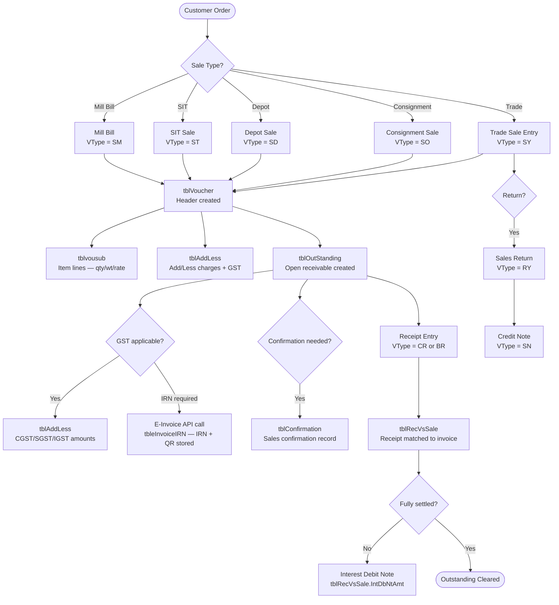
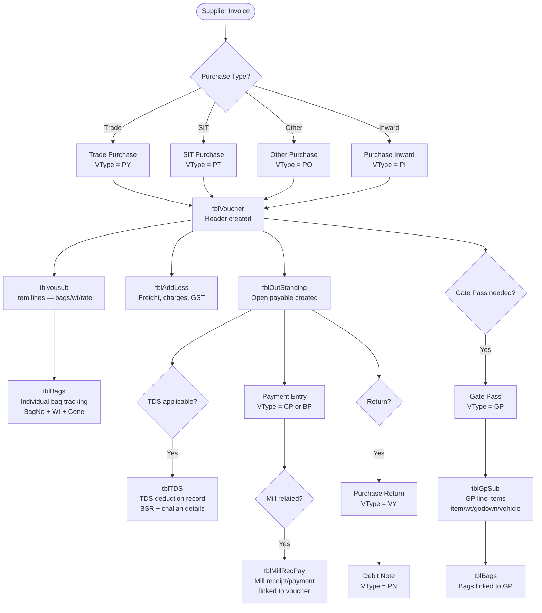
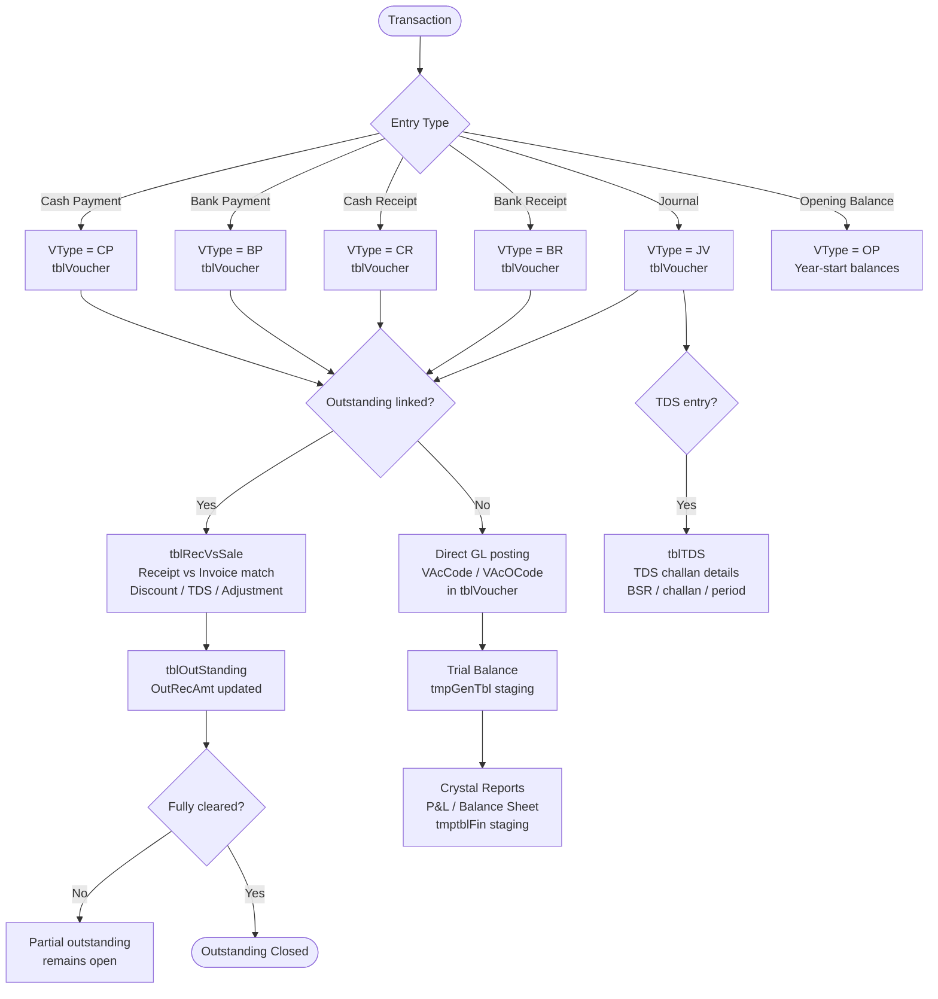
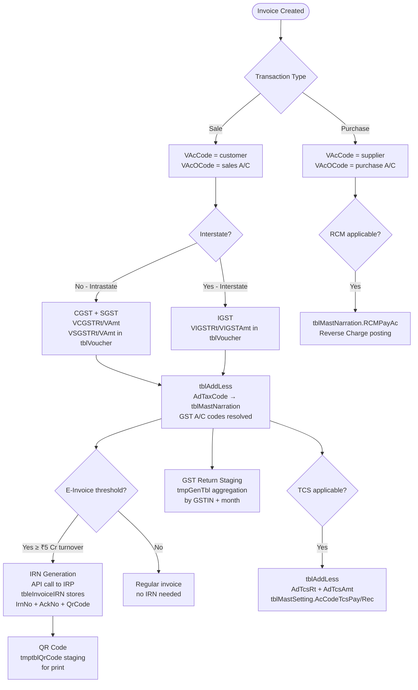
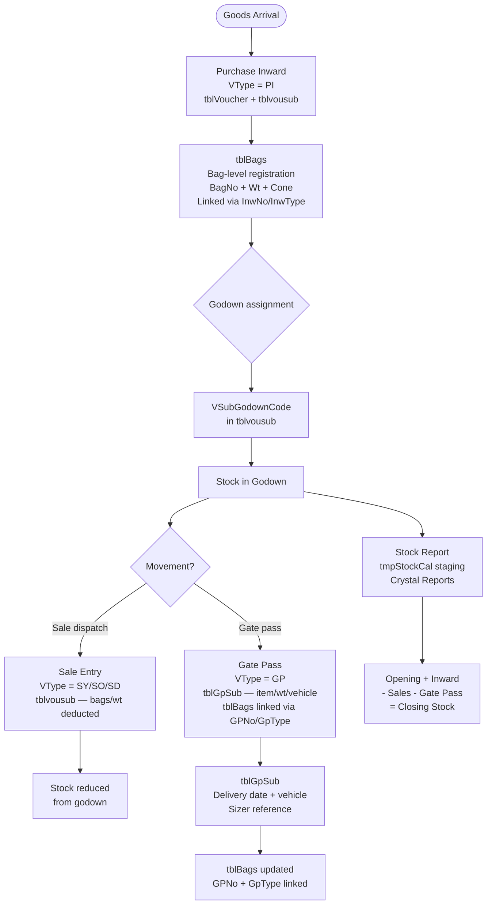

# Business Process Flows

> Derived from HITRIX VB6 form logic and Access DB structure. Voucher types in parentheses are the `VType` codes written to `tblVoucher`.

---

## Sales Cycle

---

## Purchase Cycle

---

## Finance / Accounting Cycle

---

## GST / Tax Flow

---

## Inventory / Stock Flow

