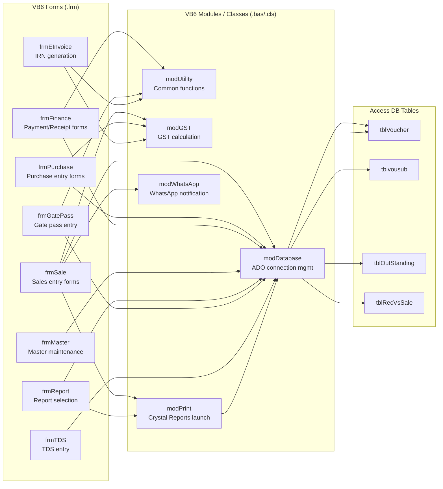
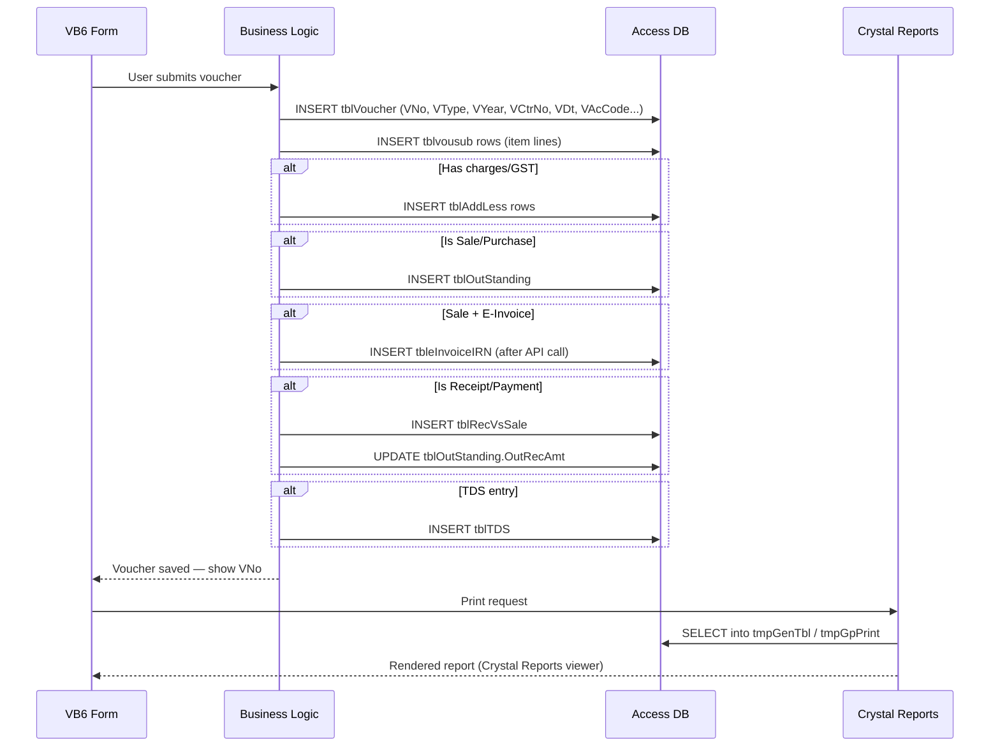

# Module Dependency Map

> Shows how HITRIX functional modules depend on each other and on shared infrastructure. Arrows point from consumer → dependency.

---

## High-Level Module Map

```mermaid
graph TD
    subgraph Masters ["Masters & Config"]
        MA[tblMastAccount\nParties / Ledgers]
        MC[tblMastCompany\nCompany Info]
        MI[tblMastItem\nItems / Products]
        MG[tblMastGroup\nAccount Groups]
        MN[tblMastNarration\nGST Tax Codes]
        MS[tblMastSetting\nSystem A/C Codes]
        MU[tblMastUser\ntblUserPrevilage]
    end

    subgraph Sales
        SY[Trade Sale - SY]
        SO[Consignment Sale - SO]
        SD[Depot Sale - SD]
        ST[SIT Sale - ST]
        SM[Mill Bill - SM]
        RY[Sales Return - RY]
    end

    subgraph Purchase
        PY[Trade Purchase - PY]
        PT[SIT Purchase - PT]
        PO[Other Purchase - PO]
        PI[Purchase Inward - PI]
        VY[Purchase Return - VY]
    end

    subgraph Finance
        CP[Cash Payment - CP]
        BP[Bank Payment - BP]
        CR[Cash Receipt - CR]
        BR[Bank Receipt - BR]
        JV[Journal Voucher - JV]
    end

    subgraph Inventory
        GP[Gate Pass - GP]
        Bags[tblBags\nBag Tracking]
    end

    subgraph TaxCompliance ["Tax & Compliance"]
        TDS[tblTDS\nTDS Records]
        IRN[tbleInvoiceIRN\nE-Invoice IRN]
        CONF[tblConfirmation\nSales Confirmation]
    end

    subgraph Adjustments
        PN[Debit Note - PN]
        SN[Credit Note - SN]
    end

    subgraph Reporting
        OS[tblOutStanding\nReceivables/Payables]
        RVS[tblRecVsSale\nReceipt Matching]
        TMP[Temp/Staging Tables\ntmpGenTbl etc.]
        RPT[Crystal Reports]
    end

    %% Masters are foundation for everything
    MA --> SY & SO & SD & ST & SM & RY
    MA --> PY & PT & PO & PI & VY
    MA --> CP & BP & CR & BR & JV
    MI --> SY & SO & PY & PT & PI
    MN --> SY & PY & CP & BP
    MS --> Finance & TaxCompliance
    MG --> MA
    MC --> IRN

    %% Sales feeds outstanding and compliance
    SY & SO & SD --> OS
    SY & SO --> IRN
    SY --> CONF
    RY --> SN

    %% Purchase feeds outstanding and TDS
    PY & PT --> OS
    PY & PT --> TDS
    VY --> PN

    %% Finance clears outstanding
    CR & BR --> RVS
    RVS --> OS
    CP & BP --> TDS

    %% Inventory links to purchase and sales
    PI --> Bags
    GP --> Bags
    SY & SO --> Bags

    %% Adjustments
    PN & SN --> OS

    %% Reporting aggregates everything
    OS --> TMP
    RVS --> TMP
    TDS --> TMP
    TMP --> RPT
```

---

## VB6 Form → Module Dependency

---

## Data Flow: Voucher Creation

---

## Module → DhanMan Service Mapping

This table maps HITRIX modules to the DhanMan microservice that covers the equivalent capability — used for gap analysis and migration planning.

| HITRIX Module | Key Tables | DhanMan Service |
|---|---|---|
| Account Masters | `tblMastAccount`, `tblMastGroup` | `common` (chart of accounts) |
| Item Masters | `tblMastItem` | `inventory` |
| Company / Settings | `tblMastCompany`, `tblMastSetting` | `common` |
| Trade Sales (SY) | `tblVoucher`, `tblvousub`, `tblAddLess` | `sales` |
| Consignment / Depot Sales | `tblVoucher` (SO/SD) | `sales` — **gap: no consignment type** |
| Mill Bill (SM) | `tblVoucher` | `sales` — **gap: no mill billing** |
| Trade Purchase (PY/PT) | `tblVoucher`, `tblvousub` | `purchase` |
| Gate Pass | `tblVoucher` (GP), `tblGpSub`, `tblBags` | `inventory` — **gap: no bag-level tracking** |
| Cash/Bank Vouchers | `tblVoucher` (CP/BP/CR/BR) | `common` (finance/GL) |
| Outstanding / Ageing | `tblOutStanding` | `sales` + `purchase` |
| Receipt Matching | `tblRecVsSale` | `sales` — **gap: no receipt-vs-invoice matching** |
| TDS | `tblTDS` | **not in DhanMan — critical gap** |
| E-Invoice / IRN | `tbleInvoiceIRN` | `document` — **gap: no IRN flow** |
| Confirmation | `tblConfirmation` | **not in DhanMan** |
| Mill Receipt/Payment | `tblMillRecPay` | **not in DhanMan — critical gap** |
| User Privileges | `tblMastUser`, `tblUserPrevilage` | Auth0 + RBAC in `common` |
| Reporting | Crystal Reports + tmp tables | **gap: no equivalent staging/Crystal layer** |
