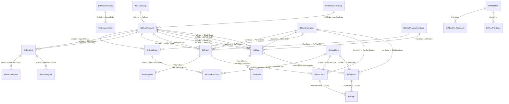

# HITRIX V2 — Data Model (SQL Server)

> All table and column names are exact — derived from the live `vtc180426.bak` database restored to SQL Server 2019 Express.

---

## Core Entity Relationships

---

## Master Tables

### tblMastCompany — Trading Firm Profile

| Column | Type | Notes |
|---|---|---|
| `CCode` | nvarchar(4) | Firm code — used as `VFirm` on all transactions |
| `CName` | nvarchar(50) | Full firm name |
| `CAdd1`–`CAdd3` | nvarchar(40) | Address lines |
| `CGSTIN` | nvarchar(20) | GST registration number |
| `CPAN`, `CTAN` | nvarchar | PAN and TAN |
| `CBankName`, `CBankAcNo`, `CBankRTGSCode` | nvarchar | Bank details for payments |
| `CmailId`, `CmailPass` | nvarchar | Email credentials for outgoing mail |
| `CisGst` | int | 0=pre-GST, 1=GST-registered firm |
| `CIsMillBillFirm` | int | 1=this firm does mill billing (SM type) |
| `CIsDepotFirm` | int | 1=depot operator |
| `CDepotMainFirm` | int | FK to main firm for depot relationship |
| `CIsTcsFirm` | smallint | 1=firm collects TCS on sales |
| `CHamaliRt`, `CLevyRt` | numeric | Default charge rates |

### tblCompanyYear — Multi-Year Partition Table

Each row defines one company's financial year and the code ranges allocated to it. Code ranges ensure master data is isolated per company-year.

| Column | Type | Notes |
|---|---|---|
| `CompCode` | nvarchar(4) | Firm code |
| `CompYear` | nvarchar(4) | Year code (e.g., "2324" for FY 2023-24) |
| `CompFdt` / `CompTdt` | datetime | Financial year start / end dates |
| `CompLdt` | datetime | Last active date (year-end lock) |
| `CompIsYrEnd` | tinyint | 1=year is closed |
| `CompSAcCode` / `CompEAcCode` | int | Account code range for this company-year |
| `CompSAgCode` / `CompEAgCode` | int | Group code range |
| `CompSItCode` / `CompEItCode` | int | Item code range |
| `CompSNarrCode` / `CompENarrCode` | int | Narration code range |

### tblMastGroup — Account Groups (Chart of Accounts Level 1)

| Column | Type | Notes |
|---|---|---|
| `AgCode` | int PK | Group code |
| `AgName` | nvarchar(40) | Group name (e.g., "Sundry Debtors", "Bank Accounts") |
| `GpCode` | int | Parent group (self-referential for hierarchy) |
| `Schedule` | nvarchar(10) | Balance sheet schedule reference |
| `TopGroup` | int | Root group code |
| `IsFixGroup` | int | 1=system group, cannot be deleted |

### tblMastSubGroup — Sub-Groups (Level 2)

| Column | Type | Notes |
|---|---|---|
| `SubCode` | int PK | |
| `SubName` | nvarchar(40) | |
| `SubGpCode` | int | Parent AgCode |
| `SubOurCode` | nvarchar(10) | Internal reference code |

### tblMastCompGroup — Corporate Groups

Firms that have multiple companies (e.g., a textile group with 3 trading companies) are linked via `tblMastCompGroup`.

### tblMastAccount — Ledger Accounts (Parties, Banks, Expense Heads)

72 columns — the most complex master. Key fields:

| Column | Type | Notes |
|---|---|---|
| `AcCode` | int PK | Ledger account code |
| `AcName` | nvarchar(60) | Account name |
| `AcAlName` | nvarchar(50) | Alternate name (for alias search) |
| `AgCode` | int FK | Account group |
| `AcGSTIN` | nvarchar(15) | Party's GST number (used for GSTR2A matching) |
| `AcPAN` | nvarchar(10) | PAN for TDS |
| `AcEmail` | nvarchar(400) | Email for notifications (multiple; semicolon-separated) |
| `AcMblNoSMS` | nvarchar(15) | Mobile for WhatsApp/SMS |
| `AcMillType` | int | 0=Trade, 1=Consignment, 2=Depot, 3=Mill Bill, 4=SIT, 5=Trade+SIT |
| `AcIntPer` | numeric | Default interest rate % for this party |
| `AcOSLimit` | numeric | Outstanding credit limit |
| `AcDueDays` | int | Default credit days for this party |
| `AcBrkCode` | int | Default broker for this party |
| `AcCmpCode` | int FK | Corporate group membership |
| `AcBillSrNo` | nvarchar(3) | Bill serial prefix |
| `AcPartyBank`, `AcPartyIFSC`, `AcPartyAcNo` | nvarchar | Party's bank details for RTGS |
| `AcIsIntDbntMonthly` | int | 1=calculate interest monthly |
| `AcIsLessTDSOnRec` | int | 1=deduct TDS at receipt time |
| `AcIsTDSfrom1stBill` | int | 1=apply TDS from first bill |
| `AcConsignmentFirm` | nvarchar(4) | For consignment: linked firm |
| `AcDepotFirm` | nvarchar(4) | For depot: linked depot firm |
| `AcIsPayToMill` | int | 1=direct mill payment |
| `AcIsGSTLessInComm` | int | 1=reduce GST from commission calculation |

### tblMastItem — Commodities / Products

| Column | Type | Notes |
|---|---|---|
| `ItCode` | int PK | |
| `ItName` | nvarchar(40) | e.g., "60s Cotton Yarn", "Polyester Hank" |
| `ItShort` | nvarchar(20) | Short name for reports |
| `ItUnit` | nvarchar(7) | "KGS", "BAGS", "MTR" |
| `ItTicket` | nvarchar(20) | Ticket/count (textile specification) |
| `ItBrokRt` | numeric | Default brokerage rate |
| `ItBrokOn` | nvarchar(10) | Brokerage base: "AMT" or "WT" |
| `ItHsn` | nvarchar(20) | HSN code (GST commodity classification) |
| `IsExGST` | int | 1=GST-exempt item |
| `ItMillCode` | int FK | Associated mill account |
| `ItType` | int | 0=Cotton, 1=Polyester, 2=Hank, etc. |
| `CharityRt`, `CharityOn` | numeric/int | Charity levy rate and basis |
| `ExemptRt` | numeric | Exemption percentage |
| `IsFrghtInsu` | int | 1=freight + insurance included in rate |
| `BookingQty` | int | Standard booking quantity (bags) |
| `InDailyReport` | int | 1=include in daily report |
| `MillRate`, `OfferRate`, `ItemRate` | numeric | Rate variants |

### tblMastNarration — Multi-Purpose Lookup (Tax Codes, Godowns, Transport)

`NarrType` distinguishes the purpose:
- `T` = Tax/GST narration (charge types with GST accounts)
- `G` = Godown (with address)
- `R` = Transport carrier
- `C` = Other charges

| Column | Type | Notes |
|---|---|---|
| `NarrCode` | int PK | |
| `Narration` | nvarchar(60) | Display name |
| `NarrType` | nvarchar(1) | T/G/R/C |
| `MastTaxRate` | decimal | Tax rate % |
| `MastTaxPurAcCode` | int | Purchase tax A/C |
| `MastTaxSAAcCode` | int | Sales tax A/C |
| `CotCGSTRt` / `CotSGSTRt` / `CotIGSTRt` | numeric | Cotton GST rates |
| `PolCGSTRt` / `PolSGSTRt` / `PolIGSTRt` | numeric | Polyester GST rates |
| `CGSTPayAc` / `SGSTPayAc` / `IGSTPayAc` | int | GST output accounts |
| `CGSTInPutAc` / `SGSTInPutAc` / `IGSTInPutAc` | int | GST input accounts |
| `RCMSaleAc` | int | RCM sale account |
| `ConsiGSTIN` | nvarchar(20) | Consignee GSTIN (for e-invoice) |

### tblMastSetting — System Configuration Accounts

Single-row table (one per company). Maps voucher types to default GL accounts and tax codes.

Key groups:
- **Sales A/Cs**: `AcCodeSY`, `AcCodeST`, `AcCodeSYHunk`, `AcCodeSYExempt`, `AcCodeRY`
- **Purchase A/Cs**: `AcCodePY`, `AcCodePT`, `AcCodePYHunk`, `AcCodePYExempt`, `AcCodeVY`
- **Tax codes per VType**: `TaxCodeSY`, `TaxCodeSO`, `TaxCodeSD`, `TaxCodeSM`, `TaxCodeST`, `TaxCodePY`, `TaxCodePT`, `TaxCodePI`
- **Transaction codes per VType**: `TranCdSY`, `TranCdPY`, etc.
- **GST accounts**: `CgstSlAcCode`, `SgstSlAcCode`, `IgstSlAcCode`, `CgstPurAcCode`, etc.
- **Late payment**: `LatePayIntAcCodeRec`, `LatePayIntAcCodePay`, `LpGrace`, `LpIntRt`
- **TDS/TCS**: `TDSAcCodeRec`, `TDSAcCodePay`, `TcsRec`, `TcsPay`, `TDSRate`
- **Discount**: `DiscAcCodeRec`, `DiscAcCodePay`
- **RCM**: `CgstRCMRecCode`, `SgstRCMRecCode`, `IgstRCMRecCode`

### tblMastTransactionCode — Configurable Transaction Codes

Maps each VType to a user-readable transaction code for reporting. Fields: `TranCode`, `TranType`, `Nature`, `Description`, booleans for `Trade`, `ConsignDepot`, `SIT`, `Other`.

### tblMastBillSerial — Bill Number Sequences

Per mill, per firm, per sale type. Manages auto-increment bill serial numbers.

### tblMastDeleAdd — Multiple Delivery Addresses per Party

Parties can have multiple delivery addresses (`DelCode` per `PartyCode`). Used in booking/sales to specify delivery point.

### tblMastFirmwiseIntRate — Per-Firm Interest Rates

Overrides the default interest rate for specific parties within a firm.

---

## Transaction Tables

### tblSale + tblSaleSub — Sales Header + Line Items

**tblSale** (one row per sale):

| Column | Type | Notes |
|---|---|---|
| `VNo`, `VType`, `VYear`, `VFirm` | PK | Composite key |
| `SlAcDrCode` | int FK | Debtor (customer) account |
| `SlAcCrCode` | int FK | Sales account (credit side) |
| `SlMillCode` | int FK | Mill account |
| `SlBroker` | int FK | Broker account |
| `SlBillNo` | nvarchar(20) | Bill number (printed on invoice) |
| `SlBillDt` | smalldatetime | Invoice date |
| `SlTransport` / `SlLorryNo` / `SlLrNo` / `SlLrDate` | | LR/transport details |
| `SlSubAmt` | numeric | Sub-total (items) |
| `SlBillAmt` | numeric | Final bill amount |
| `SlTaxableAmt` / `SlTaxCode` / `SlTaxRate` / `SlTaxAmt` | | Primary tax |
| `SlTaxableAmt2` / `SlTaxRate2` / `SlTaxAmt2` | | Secondary tax (polyester rate) |
| `SlTaxRate3` / `SlTaxAmt3` | | Tertiary tax |
| `SlAdd1` / `SlLess1` | numeric | Misc add/less adjustments |
| `SlExemptAmt` / `SlExemptPerKg` | numeric | GST-exempt portion |
| `DueDays` / `DueDate` | | Credit terms |
| `SlTranCd` | nvarchar(5) FK | Transaction code |
| `SlIsHank` | int | 1=hank item billing |
| `GpVno` / `GpVYear` / `GpNo` | | Linked gate pass |
| `SlCharityRt` / `SlCharityOn` | | Charity levy |
| `SlTcsOnAmt` / `SlTcsRate` / `SlTcsAmt` | numeric | TCS (Tax Collected at Source) |
| `SlIRNNo` / `SlAckNo` | nvarchar | E-invoice IRN and acknowledgement |
| `SlTdsRate` / `SlTdsAmt` / `SlTdsAc` | | TDS on sale |
| `SlGodown` / `SlSizer` | int | Godown and sizer reference |
| `SlUser` / `SlEntDt` | | Audit: who entered, when |

**tblSaleSub** (one row per item line):

| Column | Type | Notes |
|---|---|---|
| `VNo`, `VType`, `VYear`, `VFirm`, `SlSubItSrNo` | PK | |
| `SlSubItCtrlNo` | bigint | Global item control number (links to tblBags) |
| `SlSubPItCtrlNo` | bigint | Parent item control (for split lots) |
| `SlSubItCode` | int FK | Item |
| `SlSubBag` / `SlSubWt` | | Quantity (bags and weight kg) |
| `SlSubRt` / `SlSubNetRate` / `SlSubRtPer` | numeric | Rate, net rate, rate-per unit |
| `SlSubAmt` | numeric | Line amount |
| `SlSubGodown` | int FK | Godown (NarrCode) |
| `SlSubLotNo` | nvarchar(15) | Lot number |
| `SlSubBookNo` / `SlSubBookDt` | | Linked booking reference |
| `SlSubBkItCtrlNo` | int | Booking item control (purchase-booking link) |

### tblPurch + tblPurchSub — Purchase Header + Line Items

Mirrors tblSale/tblSaleSub structure. Key differences:

| Column | Notes |
|---|---|
| `PurAcCrCode` | Creditor (supplier) |
| `PurAcDrCode` | Purchase account (debit side) |
| `PurBillNo` / `PurBillDt` | Supplier's bill number/date |
| `PurIsRCMBill` | 1=Reverse Charge Mechanism applies |
| `PurRCMCgstRt` / `PurRCMSgstRt` / `PurRCMIgstRt` | RCM GST rates |
| `PurTdsJvNo` / `PurTdsRate` / `PurTdsAmt` | TDS deducted at purchase |
| `PurTdsOnAmt` | Amount on which TDS is calculated |
| `PurMillPaid` | Amount directly paid to mill |
| `PurIsCapitalGoods` | 1=capital goods (different input credit) |

### tblVoucher — Finance Vouchers (CP/BP/CR/BR/JV/OP)

| Column | Type | Notes |
|---|---|---|
| `VNo`, `VType`, `VYear`, `VFirm`, `VCtrNo` | PK | |
| `VDrAcCode` / `VCrAcCode` | int FK | Debit/Credit accounts |
| `VAmt` | numeric | Amount |
| `VRefTp` / `VRefNo` / `VRefDate` / `VRefBank` | | Cheque/reference details |
| `Vnar1`–`Vnar4` | nvarchar(50) | Narration lines |
| `VReconDt` | smalldatetime | Bank reconciliation date |
| `VIsAudited` | int | 1=audited and locked |
| `VBillNo` / `VBillVno` / `VBillType` / `VBillDate` | | Linked bill details (for receipt matching) |
| `VBillAmt` | numeric | Bill amount (for receipt matching) |
| `VTopCrDr` | int | 1=Dr, 2=Cr (top-level entry direction) |
| `Discount` / `LateDays` / `Interest` | | Discount and interest at receipt |
| `LessTDS` / `JvNoLessTDS` | | TDS deducted at payment |
| `IntRt` / `GraceExtra` / `IntFromDate` / `IntParty` | | Interest calc params |

### tblBooking + tblBooKingSub + tblBooKingDesp — Pre-Sale Orders

**tblBooking** — booking header (one per order):

| Column | Notes |
|---|---|
| `VNo`, `VType`, `VYear`, `VFirm`, `BkSrNo` | PK |
| `BkParty` | Buying party |
| `BkMillCode` | Supplying mill |
| `BkBroker` | Arranging broker |
| `BkItCode` | Item booked |
| `BkBag` / `BkWt` / `BkRt` | Quantity and rate |
| `BkRateType` | Rate basis (per kg, per bag, etc.) |
| `BkDeleAdd` | Delivery address (FK to tblMastDeleAdd) |
| `BkRefNo` / `BkRefDt` | Mill's reference/confirmation number |
| `DueDays` / `DueDate` | Expected delivery |
| `BkShDate` / `BkShBag` / `BkShWt` | Actual shipment date and quantity |
| `BkCDate` / `BkCbag` / `BkCWt` | Cancellation info |
| `BkIsDirectPayment` | 1=payment directly to mill |
| `BkIsFrghtInsu` / `BkIsInsu` | Freight/insurance flags |
| `BkMailSendDt` / `BkmailSendPartryDt` | Email sent timestamps |

**tblBooKingSub** — per-item-line despatch tracking within a booking.

**tblBooKingDesp** — actual despatch events linked to booking.

### tblGatePass + tblGatePassSub — Gate Pass (Consignment/Depot Delivery)

| Column | Notes |
|---|---|
| `GpAcDrCode` / `GpAcCrCode` | Dr/Cr accounts for GP |
| `GpMillCode` / `GpBroker` | Mill and broker |
| `GpNo` | Physical gate pass number |
| `GpDespDt` | Despatch date |
| `GpTransport` / `GpLorryNo` / `GpLrNo` | Transport details |
| `GpType` | 0=normal, 1=sale-linked, 2=depot |
| `VnoBill` / `VtypeBill` / `VyearBill` | Linked sale bill |

**tblGatePassSub** — line items with `GpSubItCtrlNo` (links to tblBags for individual bag tracking).

### tblBags — Individual Bag Tracking

Full lifecycle: inward → godown → sale/gate pass.

| Column | Notes |
|---|---|
| `InVNo`, `InVType`, `InVYear`, `InVFirm`, `BagNo` | PK |
| `InItCode` / `InItSrNo` | Item and line number from inward |
| `InBag` / `InWt` / `InGodown` / `InLotNo` | Inward details |
| `Cartoon` / `CartoonWt` | Cartoon count and weight |
| `SlVNo`, `SlVType`, `SlVdt`, `SlVYear`, `SlVFirm` | Linked sale/GP |
| `SlItSrNo` / `SlBillNo` / `SrNo` | Sale line reference |

### tblIntDbNote — Interest Debit Notes (Receivables)

Separate table for interest/late payment debit notes on sales. Contains full settlement tracking:

| Column | Notes |
|---|---|
| `VBillVno` / `VBillType` / `VBillVYear` / `VBillFirm` | Original sale reference |
| `VBillAmt` | Original bill amount |
| `LateDays` / `IntRt` / `Grace` | Interest calculation params |
| `Interest` / `InterestRecd` | Total interest and received so far |
| `Discount` / `LessTDS` | Deductions |
| `JvNoDisc` / `JvNoInt` / `JvNoLessTDS` | JV numbers for accounting entries |
| `CgstRt` / `SgstRt` / `IgstRt` / `CgstAmt` etc. | GST on interest |
| `SlIRNNo` / `SlAckNo` | E-invoice IRN on interest debit note |

### tblIntSale — Credit Notes / Sales Adjustments

Receipt matching table — links receipts (CP/BP/CR/BR) to sales invoices:

| Column | Notes |
|---|---|
| `VBillVno` / `VBillType` / `VBillVYear` | Original invoice |
| `VAmt` | Receipt amount |
| `Interest` / `InterestCredit` | Interest credited |
| `Broker` | Broker code |
| `IsGSTDbNt` | 1=GST debit note |
| `CrDrNoteNo` | Credit/debit note number |

---

## Audit Log Tables

Every core transaction table has a mirror `_Log` table:

| Log Table | Mirrors | Extra Columns |
|---|---|---|
| `tblSale_Log` | `tblSale` | `LogNo`, `LogTp` (I/U/D), `UserName`, `LogDate` |
| `tblSaleSub_Log` | `tblSaleSub` | Same audit columns |
| `tblPurch_Log` | `tblPurch` | Same |
| `tblPurchSub_Log` | `tblPurchSub` | Same |
| `tblVoucher_Log` | `tblVoucher` | Same |
| `tblIntSale_Log` | `tblIntSale` | Same |

These are populated by the application layer (not DB triggers) when Save/Modify/Delete is executed.

---

## Temporary / Staging Tables

Used by stored procedures to stage report data for Crystal Reports:

| Table | Purpose |
|---|---|
| `TmpGentbl` / `TmpGentbl2` | General report staging |
| `TmpRptTbl` | Report output table |
| `TmpAccLedger` | Account ledger staging |
| `TmpBooking` | Booking report staging |
| `TmpClosingBalance` | Closing balance staging |
| `tmpLotwiseStock` | Lot-wise stock staging |
| `tmpSale` | Sale staging for reports |
| `tmpSelection` / `tmpSelectionCodes` | Report date/code filters |
| `tmpWhatsAppErr` | WhatsApp notification errors |

---

## Transfer / Setup Tables

| Table | Purpose |
|---|---|
| `TfrDebitorBroker` | Transfer of debtor-broker relationships |
| `TfrOpBalOld` | Opening balance import from old system |
| `TfrOutStanding` | Outstanding transfer from previous system |

---

## Stored Procedure Index

All 51 stored procedures follow the `PrcPrepare*` naming convention — they populate temp tables for Crystal Reports. Key procedures:

| Procedure | Domain | Purpose |
|---|---|---|
| `PrcPrepareAccLedger` | Finance | Party-wise account ledger |
| `PrcPrepareAccLedgerBrokSale` | Sales | Broker-wise sale ledger |
| `PrcPrepareBookingPartyVsDesp` | Booking | Booking vs despatch comparison |
| `PrcPrepareBrokSale` | Sales | Broker commission statement |
| `PrcPrepareClBalance` | Finance | Closing balance |
| `PrcPrepareDailyReport` | Operations | Daily business summary |
| `PrcPrepareDailyReportMail` | Operations | Daily report for email |
| `PrcPrepareDailyInward` | Inventory | Daily inward report |
| `PrcPrepareDespatchDetail` | Booking | Despatch detail by party/mill |
| `PrcPrepareGetPassWiseSale` | Sales | Gate pass wise sales |
| `PrcPrepareGodownDelivery` | Inventory | Godown delivery tracking |
| `PrcPrepareGodownDeliveryPending` | Inventory | Pending godown deliveries |
| `PrcPrepareGSTR2A` | GST | GSTR-2A reconciliation |
| `PrcPrepareGSTR3B` | GST | GSTR-3B summary |
| `PrcPrepareIntDebitNote` | Finance | Interest debit note register |
| `PrcPrepareLotwiseGodownStock` | Inventory | Lot-wise godown stock |
| `PrcPrepareLotwiseGodownStockDetail` | Inventory | Detailed lot stock |
| `PrcPrepareLotwiseStock` | Inventory | Lot-wise stock summary |
| `PrcPrepareMillStatement` | Mill | Mill statement (commission) |
| `PrcPrepareMillStatementMillBill` | Mill | Mill bill statement |
| `PrcPrepareOpBalance` | Finance | Opening balance |
| `PrcPrepareOutStangingSale` | Finance | Outstanding receivables |
| `PrcPrepareOutStangingSaleDirectPayment` | Finance | Direct payment outstanding |
| `PrcPreparePendingBookingMillBill` | Booking | Pending mill bill bookings |
| `PrcPreparePendingBookingParty` | Booking | Pending party bookings |
| `PrcPreparePendingBookingPurch` | Booking | Pending purchase bookings |
| `PrcPreparePurchaseDetail` | Purchase | Purchase detail register |
| `PrcPreparePurchaseDetailSIT` | Purchase | SIT purchase detail |
| `PrcPreparePurchaseGST` | GST | Purchase GST register |
| `PrcPrepareRegisterCrDrNoteGST` | GST | Cr/Dr note GST register |
| `PrcPrepareRegisterJV` | Finance | JV register |
| `PrcPrepareRegisterLpInt` | Finance | Late payment interest register |
| `PrcPrepareSaleDetailSIT` | Sales | SIT sale detail |
| `PrcPrepareSaleItemDetail` | Sales | Item-wise sale detail |
| `PrcPrepareSaleRegister` | Sales | Sales register |
| `PrcPrepareSaleRegisterGST` | GST | Sales GST register |
| `PrcPrepareSalesRegisterRCM` | GST | RCM sales register |
| `PrcPrepareSaleStatus` | Sales | Sale status report |
| `PrcPrepareSaleStatusRatewise` | Sales | Rate-wise sale status |
| `PrcPrepareStock` | Inventory | Stock report |
| `PrcPrepareStockDaily` | Inventory | Daily stock movement |
| `PrcPrepareStockLedger` | Inventory | Stock ledger |
| `PrcPrepareSubAcShedule` | Finance | Sub-account schedule |
| `PrcPrepareTcsReceivable` | Tax | TCS receivable |
| `PrcPrepareVatComputation` | Tax | VAT computation (legacy) |
| `PrcPrepareVatTWSalePurch` | Tax | VAT trade-wise |
| `PrcPrepareYearEnd` | Admin | Year-end processing |
