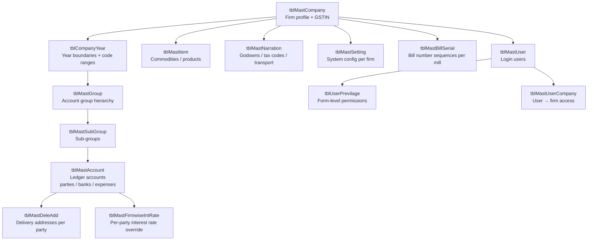

# Master Data Domain

Master data defines every entity referenced in transactions — companies, accounts, items, narrations, and system settings. All master tables are scoped to a `VFirm` + `VYear` code range, allowing a single SQL Server database to serve multiple trading firms across multiple financial years.

---

## Master Data Hierarchy



---

## tblMastCompany — Trading Firm

Each row is one trading firm. The `CCode` (4-char) is the `VFirm` key on every transaction table.

| Field | Description |
|---|---|
| `CCode` | 4-char firm code — the partition key for all transactions |
| `CName` | Full legal name |
| `CGSTIN` | GST registration number (first 2 digits = state code) |
| `CPAN` / `CTAN` | PAN and TAN for TDS compliance |
| `CBankName` / `CBankAcNo` / `CBankRTGSCode` | Firm's bank for payments |
| `CisGst` | 1 = GST-registered firm (enables GST fields on entry forms) |
| `CIsMillBillFirm` | 1 = firm does mill bill (SM) operations |
| `CIsDepotFirm` | 1 = depot operator (changes receipt label and routing) |
| `CDepotMainFirm` | FK to main firm for depot–parent relationship |
| `CIsTcsFirm` | 1 = firm collects TCS on sales (Section 206C) |
| `CmailId` / `CmailPass` | SMTP credentials for outgoing email notifications |

---

## tblCompanyYear — Multi-Year Code Ranges

Each firm-year has its own row. Code ranges (`CompSAcCode`–`CompEAcCode`, etc.) isolate master data so accounts created in one year don't bleed into another:

| Field | Description |
|---|---|
| `CompCode` / `CompYear` | Firm + year key |
| `CompFdt` / `CompTdt` | Financial year start / end dates |
| `CompLdt` | Last active date (year-end lock) |
| `CompIsYrEnd` | 1 = year is closed; blocks new transactions |
| `CompSAcCode` / `CompEAcCode` | Account code range for this company-year |
| `CompSItCode` / `CompEItCode` | Item code range |
| `CompSNarrCode` / `CompENarrCode` | Narration code range |

---

## tblMastGroup / tblMastSubGroup — Chart of Accounts

Two-level group hierarchy:

```
tblMastGroup (level 1)
  └── tblMastSubGroup (level 2)
        └── tblMastAccount (leaf — actual ledgers)
```

Standard groups include: Sundry Debtors, Sundry Creditors, Bank Accounts, Cash, Sales, Purchases, GST Payable, GST Receivable, TDS Payable, Capital.

`IsFixGroup = 1` marks system groups that cannot be deleted or renamed.

---

## tblMastAccount — Ledger Accounts

The central master — every party, bank, expense account, and GST ledger is a row here. 72 columns. Critical fields for transaction processing:

| Field | Description |
|---|---|
| `AcCode` | Primary key — referenced by `SlAcDrCode`, `PurAcCrCode`, etc. |
| `AcOurCode` | Short search code (4 chars) — typed in forms for fast lookup |
| `AcGSTIN` | Party's GST number (used in GSTR-2A matching and interstate detection) |
| `AcPAN` | PAN for TDS threshold tracking |
| `AcMillType` | 0=Trade, 1=Consignment, 2=Depot, 3=Mill Bill, 4=SIT, 5=Trade+SIT |
| `AcDueDays` | Default credit period (flows into `DueDays` on sale) |
| `AcIntPer` | Default interest rate % for overdue bills |
| `AcOSLimit` | Credit limit — outstanding balance warning threshold |
| `AcIsLessTDSOnRec` | 1 = deduct TDS on receipt (Section 194Q) |
| `AcIsTDSfrom1stBill` | 1 = deduct TDS from first bill (no threshold wait) |
| `AcBrkCode` | Default broker assigned to this party |
| `AcBillSrNo` | Bill serial prefix (3-char) — populates `tblMastBillSerial` |
| `AcPartyBank` / `AcPartyIFSC` / `AcPartyAcNo` | Party bank details for RTGS payment advice |
| `AcMblNoSMS` | Mobile number for WhatsApp notification after invoice |
| `AcEmail` | Semicolon-separated email list for bill dispatch |
| `AcIsIntDbntMonthly` | 1 = calculate interest monthly (not annually) |
| `AcConsignmentFirm` | Linked firm code for consignment arrangement |
| `AcDepotFirm` | Linked depot firm code |
| `AcDepotHoAc` | HO account for depot TDS routing |
| `AcIsExemptMill` | 1 = exempt mill (mandi/cotton cess exemption) |

---

## tblMastItem — Commodities / Products

| Field | Description |
|---|---|
| `ItCode` | Primary key — referenced by `SlSubItCode`, `PurSubItCode` |
| `ItName` | Full name (e.g., "60s Cotton Yarn 30 Lea") |
| `ItShort` | Abbreviated name for reports and grids |
| `ItUnit` | Unit of measure: KGS / BAGS / MTR |
| `ItTicket` | Textile count specification (e.g., "60s", "2/40") |
| `ItHsn` | HSN code for GST classification |
| `ItType` | 0=Cotton, 1=Polyester, 2=Hank — determines which GST rate pair to use |
| `IsExGST` | 1 = GST-exempt item |
| `ItBrokRt` / `ItBrokOn` | Brokerage rate and basis (AMT or WT) |
| `ItMillCode` | Default mill account for this item |
| `CharityRt` / `CharityOn` | Charity levy rate and calculation basis |
| `ExemptRt` | Exempt (non-GST) rate % |
| `BookingQty` | Standard booking quantity in bags |
| `InDailyReport` | 1 = include item in daily transaction report |

---

## tblMastNarration — Multi-Purpose Lookup

`NarrType` controls what a row represents:

| NarrType | Purpose | Example |
|---|---|---|
| `T` | Tax / GST charge type | "G S T" row holds all GST rates and accounts |
| `G` | Godown (warehouse location) | "MAIN GODOWN", "DEPOT STORE" |
| `R` | Transport carrier | "GUJARAT ROADWAYS" |
| `C` | Other charge type | "FREIGHT", "INSURANCE" |

The single row `WHERE Narration='G S T'` carries all GST rate and account configurations used by every sale, purchase, and credit note entry:

```
CotCGSTRt / CotSGSTRt / CotIGSTRt    cotton GST rates
PolCGSTRt / PolSGSTRt / PolIGSTRt    polyester GST rates
CGSTPayAc / SGSTPayAc / IGSTPayAc    output GST accounts
CGSTInPutAc / SGSTInPutAc / IGSTInPutAc   input (ITC) accounts
RCMSaleAc                             RCM output liability account
```

---

## tblMastSetting — System Configuration

Single row per company. Loaded at login by `GProcGetSettingDetail` into 50+ global VB6 variables. Groups:

| Group | Fields |
|---|---|
| Sales accounts | `AcCodeSY`, `AcCodeST`, `AcCodeSYHunk`, `AcCodeSYExempt`, `AcCodeRY` |
| Purchase accounts | `AcCodePY`, `AcCodePT`, `AcCodePYHunk`, `AcCodePYExempt`, `AcCodeVY` |
| GST accounts | `CgstSlAcCode`, `SgstSlAcCode`, `IgstSlAcCode`, `CgstPurAcCode` |
| Tax codes per VType | `TaxCodeSY`, `TaxCodeSO`, `TaxCodeSD`, `TaxCodeSM`, `TaxCodePY`, `TaxCodePT` |
| Transaction codes | `TranCdSY`, `TranCdPY`, `TranCdPI`, etc. |
| Late payment | `LatePayIntAcCodeRec`, `LpGrace` (grace days), `LpIntRt` (interest rate %) |
| TDS/TCS | `TDSAcCodeRec`, `TDSAcCodePay`, `TcsRec`, `TcsPay`, `TDSRate` |
| RCM | `SgstRCMRecCode`, `CgstRCMRecCode`, `IgstRCMRecCode` |
| Discount / round-off | `DiscAcCodeRec`, `DiscAcCodePay`, `RoundOffAc` |
| Brokerage | `BrokerageSaleAc`, `CommissionSaleAc` |

---

## tblMastBillSerial — Invoice Number Sequences

Manages auto-increment bill numbers per mill per firm per sale type. Format: `<prefix>999999`.

| Field | Description |
|---|---|
| `BillSr` | 3-char prefix (e.g., "MAH", "RAM") |
| `Vno` | Current sequence number (increments on each bill) |
| `VType` | Sale type (SY, SO, SD, etc.) |
| `VFirm` | Firm code |
| `AcCode` | Mill account (different series per mill) |

---

## tblMastDeleAdd — Delivery Addresses

A party can have multiple delivery points. Each booking and sale line can specify a `DelCode`:

| Field | Description |
|---|---|
| `PartyCode` | FK to `tblMastAccount.AcCode` |
| `DelCode` | Delivery address code |
| `DelAdd1`–`DelAdd3` | Address lines |
| `DelCity` / `DelState` / `DelPin` | Location |
| `DelGSTIN` | GSTIN at delivery point (for e-invoice consignee) |

---

## User Management

**`tblMastUser`** — login credentials and user profile.

**`tblUserPrevilage`** — form-level access control. One row per user per form name:

| Field | Description |
|---|---|
| `UserName` | FK to tblMastUser |
| `FormName` | VB6 form name (e.g., "frmSalesGST") |
| `IsAdd` / `IsModify` / `IsDelete` / `IsView` | Boolean permissions |
| `IsAudit` | 1 = can mark entries as audited |
| `IsPrint` | 1 = can print |

**`tblMastUserCompany`** — which firms a user can access. A user can be restricted to a subset of the firms in the database.

---

## Key Business Rules

| Rule | Detail |
|---|---|
| Code range isolation | Each company-year gets a numeric range for accounts, items, narrations — prevents cross-year contamination |
| `AcOurCode` lookup | Users type a 4-char short code in forms; system resolves to `AcCode` for storage |
| Year-end lock | `CompIsYrEnd = 1` blocks all new transactions for that company-year |
| Mill type routing | `AcMillType` on the account determines which forms and VTypes are available for that mill |
| Multi-delivery address | `tblMastDeleAdd` supports consignee GSTIN per delivery point — needed for e-invoice |
| WhatsApp / email | `AcMblNoSMS` and `AcEmail` on account drive post-save notifications in frmSalesGST |

---

## DhanMan Gaps

| Gap | Detail |
|---|---|
| Multi-year code ranges | `tblCompanyYear` code range isolation has no DhanMan equivalent — DhanMan uses financial year scoping per entity |
| `AcMillType` routing | Account-level mill type (Trade/Consignment/Depot/SIT) controls which forms are shown — DhanMan needs party type flag |
| Dual GST rates in narration | The `Narration='G S T'` row holding both cotton and polyester rates has no direct DhanMan equivalent — DhanMan needs item-type-level GST rate configuration |
| `tblMastBillSerial` | Per-mill bill number series — DhanMan needs a configurable invoice series per counterparty / sale type |
| `tblMastDeleAdd` | Multiple delivery addresses with per-address GSTIN — needed for e-invoice consignee field |
| `tblMastSetting` migration | ~50 GL account code settings must migrate to DhanMan company settings API |
| Form-level permissions | `tblUserPrevilage` (per form: add/modify/delete/audit/print) — DhanMan needs fine-grained role/permission model |
| `tblInterestCalDate` | Per-party interest calculation start date override — not in DhanMan |
