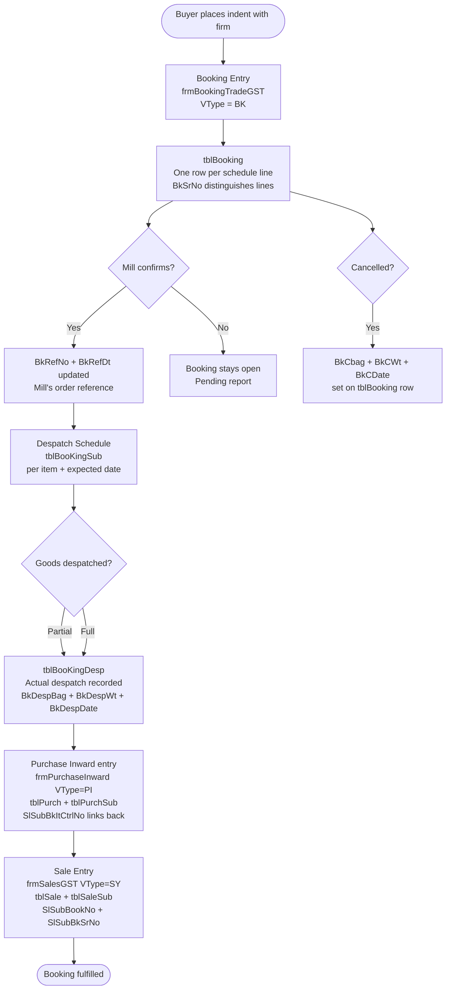

# Booking & Order Management

The booking module is the **pre-sale order capture** system — the most significant addition in V2 over the Access version. A booking records a commitment from a mill to supply specific goods to a buyer, placed by the trading firm acting as agent. Every sale eventually traces back to one or more booking lines.

---

## Business Flow



---

## Booking Variants

| VType | Form | Use Case |
|---|---|---|
| `BK` | `frmBookingTradeGST` | Standard GST-era booking — party + mill + item + schedule |
| `BT` | `frmBookingTrade` | Legacy pre-GST booking (writes to `tblPurchSub`, not `tblBooking`) |
| `BM` | `frmBookingMillBill` | Mill bill booking — firm's own mill billing arrangement |
| `BD` | `frmBookingMillBillDespatch` / `frmBookingMillBillDespatchNew` | Despatch against mill bill booking |

---

## Key Design: One Row Per Schedule Line

`tblBooking` is **not** a single-row-per-booking table. Each row is one despatch schedule line — the booking header fields (`BkParty`, `BkMillCode`, `BkBroker`, `BkItCode`, `BkRt`) are repeated on every row, while `BkSrNo` distinguishes schedule lines within the same booking (`VNo + VType + VYear + VFirm`).

**Example:** Booking VNo=1001 for 500 bags, split into 3 shipments = 3 rows in `tblBooking` with `BkSrNo` 1, 2, 3.

---

## Business Rules

| Rule | Detail |
|---|---|
| Rate types | `BkRateType` controls whether rate is per kg, per 100kg, per bag, etc. |
| Delivery address | `BkDeleAdd` links to `tblMastDeleAdd` — a party can have multiple delivery points |
| Direct payment | `BkIsDirectPayment = 1` means payment goes directly to mill, bypassing the firm |
| Freight/insurance | `BkIsFrghtInsu` and `BkIsInsu` flags determine whether freight + insurance are included in the rate |
| Mail notifications | `BkMailSendDt` and `BkmailSendPartryDt` track when confirmation emails were sent to mill and party |
| Pending booking report | `PrcPreparePendingBookingParty`, `PrcPreparePendingBookingPurch`, `PrcPreparePendingBookingMillBill` — three stored procedures track open bookings |
| Booking vs despatch | `PrcPrepareBookingPartyVsDesp` compares booked quantity against actual despatched quantity per party |

---

## Booking → Sale Link

The link from booking to the eventual sale is maintained via:

- `tblSaleSub.SlSubBookNo` = the booking `VNo`
- `tblSaleSub.SlSubBkSrNo` = the booking schedule `BkSrNo`
- `tblSaleSub.SlSubBkVyear` = the booking `VYear`
- `tblSaleSub.SlSubBkDespSrNo` = the despatch serial from `tblBooKingDesp`

This creates a full audit trail: **Booking line → Despatch event → Purchase inward line → Sale line**.

---

## DhanMan Gap

DhanMan has **no booking module**. This is a P0 critical gap — all HITRIX clients use bookings as the starting point of every trade.

**What needs to be built in DhanMan:**

```
BookingOrder {
    id, companyId, financialYearId
    partyId (buyer)
    millId
    brokerId
    itemId, bags, weightKg, rate, ratePer, rateType
    refNo, refDate (mill's confirmation)
    deliveryAddressId
    isDirectPayment, isFreightInsurance
    scheduleLines: [{ srNo, scheduledDate, scheduledBags, scheduledWt }]
    despatchLines: [{ srNo, despatchDate, despatchBags, despatchWt }]
    status: OPEN | PARTIAL | FULFILLED | CANCELLED
}
```

`sales` service must also store `bookingOrderId` + `bookingLineId` on every sale line item for traceability.
