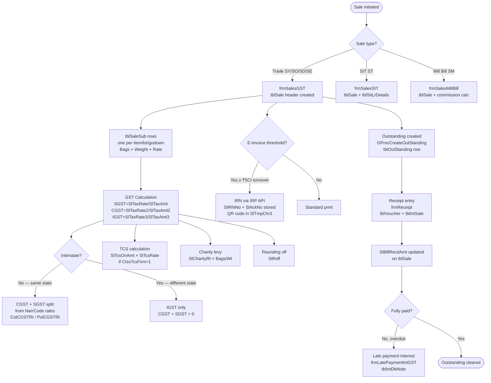

# Sales Domain

All sale transactions write to `tblSale` (header) + `tblSaleSub` (item lines), differentiated by `VType`. The single form `frmSalesGST` handles four of the five sale types; separate forms handle SIT and Mill Bill.

---

## Sale Types

| VType | Description | Credit A/C | Form |
|---|---|---|---|
| `SY` | Trade Sale | `tblMastSetting.AcCodeSY` | `frmSalesGST` |
| `SO` | Consignment Sale | Mill's own account | `frmSalesGST` |
| `SD` | Depot Sale | Depot mill's account | `frmSalesGST` |
| `SE` | Exempt Sale | `AcCodeSYExempt` | `frmSalesGST` |
| `ST` | SIT — Sale in Transit | `AcCodeST` | `frmSalesSIT` |
| `SM` | Mill Bill (commission billing) | Mill's account | `frmSalesMillBill` |
| `RY` | Sales Return | `AcCodeRY` | `frmSalesReturn` |
| `SC` / `SB` | Other sales/charges | Varies | `frmSalesOtherGST` |

---

## Business Flow



---

## GST Calculation Logic

HITRIX stores CGST and SGST in separate rate/amount fields (not a single "GST rate"):

```
SlTaxRate   = SGST rate %     SlTaxAmt   = SGST amount
SlTaxRate2  = CGST rate %     SlTaxAmt2  = CGST amount
SlTaxRate3  = IGST rate %     SlTaxAmt3  = IGST amount
```

Rate selection per item type:
- **Cotton** → `tblMastNarration.CotCGSTRt` / `CotSGSTRt` / `CotIGSTRt`
- **Polyester/Synthetic** → `tblMastNarration.PolCGSTRt` / `PolSGSTRt` / `PolIGSTRt`

Interstate detection: if buyer's state (from `tblMastAccount.AcState`) ≠ firm's state (`tblMastCompany.CGSTIN` prefix) → IGST applies, CGST+SGST = 0.

**Exempt component:** For cotton cess/mandi tax — `SlExemptAmt = SlExemptPerKg × SlSubWt`. The `PurExemptPerKg` from the source purchase flows into `SlExemptPerKg` on the matching sale.

---

## Bill Number Generation

Bill numbers follow format `SSSS999999` where:
- `SSSS` = `tblMastBillSerial.BillSr` (3-char prefix per mill/sale-type)
- `999999` = sequential number from `tblMastBillSerial.Vno`

`tblMastBillSerial` allows different series per mill and per firm, so the same firm can issue bills `MAH0001`, `RAM0001` etc. for different mills.

---

## Key Business Rules

| Rule | Detail |
|---|---|
| VNo generation | `GProcGenerateIdMonthwise` — monthly sequence per VType+VFirm |
| Outstanding | Created by `GProcCreateOutStanding` at save time — one row per bill in `tblOutStanding` |
| Audit log | Every save/modify/delete writes a row to `tblSale_Log` / `tblSaleSub_Log` with `LogTp` A/M/D |
| Audited lock | `SlIsAudited = 1` → form becomes read-only, no modifications allowed |
| Booking link | `SlSubBookNo + SlSubBkSrNo + SlSubBkVyear` links each line back to booking schedule |
| Godown | `SlSubGodown` (NarrCode, NarrType=G) — each line can come from a different godown |
| Lot number | `SlSubLotNo` — tracks the physical lot/batch, used for lot-wise stock reports |
| Gate pass link | `GpVno + GpVYear + GpNo` on header — for consignment/depot sales linked to a gate pass |
| SIT LR details | `frmSalesSIT` additionally writes to `tblSitLrDetails` — each LR with bags/weight per lorry |
| Mill Bill (SM) | Commission is calculated as `ItBrokRt × Weight` from `tblMastItem`; the mill is both the party and the credit account |
| WhatsApp | After save, the form optionally sends WhatsApp notification to buyer using `AcMblNoSMS` |

---

## DhanMan Gaps

| Gap | Detail |
|---|---|
| Sale types SO, SD, SE, ST, SM | Only basic trade sale exists in DhanMan |
| GST dual-rate (cotton vs polyester) | DhanMan has single tax rate per item; HITRIX has two rates per item |
| Bill serial management | Per-mill sequential bill numbers not in DhanMan |
| Booking linkage on sale lines | `bookingOrderId` + `bookingLineId` must be on every sale line |
| Exempt component flow | `ExemptPerKg` flowing from purchase to sale is textile-specific |
| `tblSitLrDetails` | SIT lorry-receipt detail table has no DhanMan equivalent |
| TCS collection | `SlTcsRate` / `SlTcsAmt` — not in DhanMan sales service |
| E-invoice IRN | `document` service needs IRP API integration |
