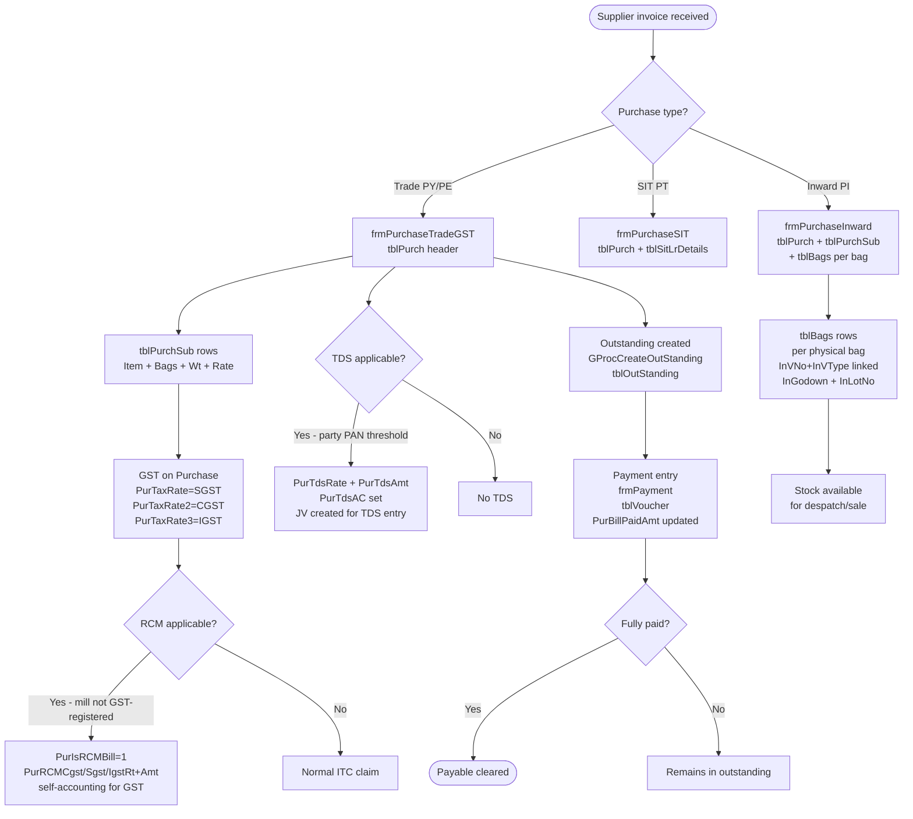

# Purchase Domain

All purchase transactions write to `tblPurch` (header) + `tblPurchSub` (item lines). The purchase domain includes trade purchases from mills, SIT purchases, inward/outward of factory goods, and other sundry purchases.

---

## Purchase Types

| VType | Description | Debit A/C | Form |
|---|---|---|---|
| `PY` | Trade Purchase (GST) | `AcCodePY` | `frmPurchaseTradeGST` |
| `PE` | Exempt Purchase | `AcCodePYExempt` | `frmPurchaseTradeGST` |
| `PT` | SIT Purchase | `AcCodePT` | `frmPurchaseSIT` |
| `PI` | Goods Inward (to godown) | `TranCdPI` | `frmPurchaseInward` |
| `PR` | Goods Outward (from godown) | — | `frmPurchaseInward` |
| `VY` | Purchase Return | `AcCodeVY` | `frmPurchaseReturn` |
| `PX` | Other Purchase / charges | Varies | `frmPurchaseOther` |

---

## Business Flow



---

## RCM (Reverse Charge Mechanism)

When a mill/supplier is **not GST-registered**, the buyer (firm) must self-account for GST under RCM:

```
PurIsRCMBill   = 1        (flag — this is an RCM purchase)
PurRCMBillNo               (RCM self-invoice / challan number)
PurRCMBillDt               (date of self-invoice)
PurRCMSaleAc               (account for RCM output liability)
PurRCMCgstRt + PurRCMCgstAmt   (CGST to be paid under RCM)
PurRCMSgstRt + PurRCMSgstAmt   (SGST)
PurRCMIgstRt + PurRCMIgstAmt   (IGST)
```

The RCM amount is posted via a JV entry: Dr RCM Input Credit A/C, Cr RCM Output Liability A/C. The ITC is claimable only after the RCM GST is paid.

---

## TDS on Purchase

Section 194Q (purchases above ₹50L from a single party in a year) and 194C (contract payments):

```
PurTdsRate     — TDS %
PurTdsAmt      — TDS amount deducted
PurTdsOnAmt    — base amount (usually PurBillAmt)
PurTdsAC       — TDS payable account
PurTdsJvNo     — JV created for the TDS entry
```

The form checks the party's cumulative `PurBillAmt` for the year to determine if the TDS threshold is crossed.

---

## Bag-Level Tracking (PI — Goods Inward)

For `frmPurchaseInward` (VType=PI), in addition to `tblPurchSub`, individual bags are registered in `tblBags`:

| Field | Description |
|---|---|
| `InVNo`, `InVType`, `InVYear`, `InVFirm` | Links to the PI purchase entry |
| `InItSrNo` | Line number in `tblPurchSub` |
| `BagNo` | Physical bag tag number |
| `InBag` | Bag count (usually 1 per row) |
| `InWt` | Weight in kg |
| `InGodown` | Godown code |
| `InLotNo` | Lot number |
| `Cartoon` / `CartoonWt` | Cartoon packaging details |
| `SlVNo`, `SlVType`, `SlVYear`, `SlVFirm` | Filled when bag is sold/despatched |
| `SlItSrNo`, `SlBillNo` | Sale line reference |

This enables **lot-wise stock** and **bag-wise traceability** from inward to sale.

---

## Exempt Component Flow

Cotton purchases include a non-GST levy (mandi tax / cotton cess). This is tracked as:
- `PurExemptAmt` — total exempt levy on this purchase
- `PurExemptPerKg` — exempt rate per kg

When a **matching exempt sale (SE)** is entered, `PurExemptPerKg` flows from the source purchase into `SlExemptPerKg` on the sale — ensuring the correct levy recovery from the buyer.

---

## Capital Goods

`PurIsCapitalGoods = 1` marks a purchase as capital goods (machinery, equipment). This affects:
- ITC classification in GSTR-3B (50% ITC in year 1 for capital goods)
- Separate line in purchase GST register (`PrcPreparePurchaseGST`)

---

## Key Business Rules

| Rule | Detail |
|---|---|
| Bill number | Supplier's bill number stored in `PurBillNo` / `PurBillDt` — distinct from internal VNo |
| Audit log | `tblPurch_Log` + `tblPurchSub_Log` — every change logged with LogTp A/M/D |
| Outstanding | `GProcCreateOutStanding` creates payable record at save time |
| SIT LR | `frmPurchaseSIT` writes to `tblSitLrDetails` — individual lorry receipts per PI |
| Purchase return | VY type reverses the original PY entry; `PurSubIssBag` / `PurSubIssWt` track returned bags/weight |
| TCS on purchase | `PurTcsAmt` / `PurTcsRate` — TCS collected by supplier, recorded here for reconciliation |
| Mill paid amount | `PurMillPaid` — direct payment amount to mill (for direct payment bookings) |

---

## DhanMan Gaps

| Gap | Detail |
|---|---|
| RCM purchase | `PurIsRCMBill` + self-invoicing + ITC calculation — not in DhanMan |
| TDS on purchase | `PurTdsRate` / `PurTdsJvNo` — legally required for 194Q/194C |
| Bag-level tracking | `tblBags` per PI entry — completely absent from DhanMan |
| Exempt component | `PurExemptPerKg` flowing to SE sale — textile-specific |
| SIT LR details | `tblSitLrDetails` for lorry-wise receipts |
| Capital goods flag | `PurIsCapitalGoods` for ITC classification |
| Purchase inward (PI) | Separate inward type with bag registration — different from basic purchase |
