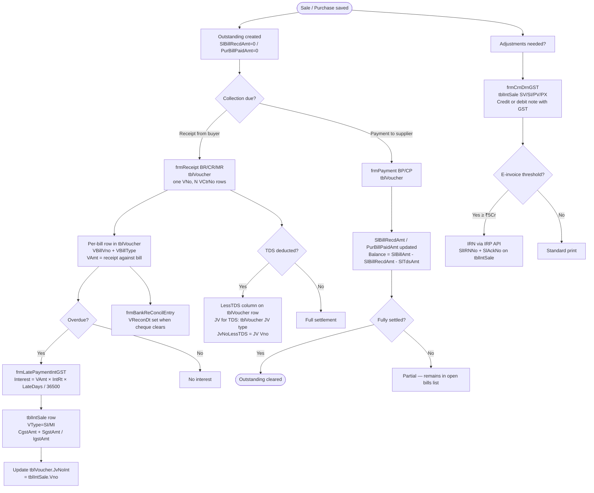

# Finance & Accounting Domain

All monetary flows pass through `tblVoucher`. The finance domain covers five subsystems: receipts and payments, journal vouchers, credit/debit notes, late payment interest, and bank reconciliation.

---

## Voucher Types

| VType | Description | Form | Table |
|---|---|---|---|
| `BR` | Bank Receipt | `frmReceipt` | `tblVoucher` |
| `CR` | Cash Receipt | `frmReceipt` | `tblVoucher` |
| `MR` | Mill Receipt (direct mill payment) | `frmReceipt` | `tblVoucher` |
| `BP` | Bank Payment | `frmPayment` | `tblVoucher` |
| `CP` | Cash Payment | `frmPayment` | `tblVoucher` |
| `JV` | Journal Voucher | `frmJV` | `tblVoucher` |
| `SV` | Sale Credit Note (with GST) | `frmCrnDrnGST` | `tblIntSale` |
| `SI` | Sale Debit Note / Interest Debit Note | `frmCrnDrnGST` / `frmLatePaymentIntGST` | `tblIntSale` |
| `PV` | Purchase Credit Note (with GST) | `frmCrnDrnGST` | `tblIntSale` |
| `PX` | Purchase Debit Note (with GST) | `frmCrnDrnGST` | `tblIntSale` |
| `MI` | Mill Interest Debit Note | `frmLatePaymentIntGST` | `tblIntSale` |

---

## Business Flow



---

## Key Design: Multi-Line Voucher

One receipt or payment `VNo` covers multiple bills. Each bill gets its own row in `tblVoucher` identified by `VCtrNo`:

```
VNo=501, VType=BR, VYear=2024, VFirm=ABAB
  VCtrNo=1 → Bill SY/1001, VAmt=50,000, LessTDS=500
  VCtrNo=2 → Bill SY/1002, VAmt=80,000, Interest=1,200
  VCtrNo=3 → Bill SM/2001, VAmt=30,000
```

The header bank/cash account (`VDrAcCode` for receipts, `VCrAcCode` for payments) is the same for all rows. Each row carries its own `VBillVno + VBillType + VBillVYear + VBillFirm` to identify which document is being settled.

---

## Outstanding Tracking

HITRIX tracks outstanding via **denormalised columns** on the transaction table — not via a separate ledger:

| Source | Running total | Balance formula |
|---|---|---|
| `tblSale` | `SlBillRecdAmt` | `SlBillAmt - SlBillRecdAmt - SlTdsAmt` |
| `tblPurch` | `PurBillPaidAmt` | `PurBillAmt - PurBillPaidAmt` |

The receipt form's bill-lookup query is a direct filter on `tblSale` where balance > 0 — `tblOutStanding` exists in code but its population (`GProcCreateOutStanding`) is commented out in the GST-era forms.

---

## tblVoucher — Key Fields

PK: `VNo + VType + VYear + VFirm + VCtrNo`

| Field | Description |
|---|---|
| `VCtrNo` | Line counter within voucher (1..n per VNo) |
| `VCrAcCode` / `VDrAcCode` | Credit / debit account codes |
| `VAmt` | Amount for this line |
| `VRefTp` | Reference type: Cheque / RTGS / Transfer / D.D. / Other |
| `VRefNo` | Cheque number / RTGS reference |
| `VRefDate` / `VRefBank` | Instrument date and bank |
| `VReconDt` | Bank reconciliation date (NULL = unreconciled) |
| `VBillNo` / `VBillVno` / `VBillType` / `VBillVYear` | Bill being settled |
| `VBillFirm` | Firm of the bill (cross-firm depot settlement) |
| `VBillAmt` | Original bill amount |
| `Discount` | Discount allowed/received on this settlement |
| `LessTDS` | TDS deducted on settlement |
| `JvNoLessTDS` | JV Vno for the TDS deduction entry |
| `Interest` | Late payment interest on this bill |
| `JvNoInt` | `tblIntSale.Vno` for the interest debit note |
| `VnoList` | Batch group key for late-payment interest session |
| `LateDays` | Days overdue at time of receipt |
| `DueOnDt` / `Grace` / `GraceExtra` | Due date and grace days |
| `IntRt` / `IntFromDate` | Interest rate % and start date |
| `CgstRt+Amt`, `SgstRt+Amt`, `IgstRt+Amt` | GST on interest |
| `TdsRt` / `TDSOn` | TDS rate % and base amount |
| `IsGSTDbNt` | 1 = GST debit note on this line |
| `CrDrNoteNo` | Credit/debit note number |

---

## Late Payment Interest

Interest is calculated and posted via `frmLatePaymentIntGST`. The form navigates by `VnoList` (not `VNo`) — a single `VnoList` batch groups all receipt rows across multiple bills in the same interest session.

**Calculation:**
```
LateDays  = DATEDIFF(days, DueOnDt, today) - Grace - GraceExtra
Interest  = (VAmt × IntRt × LateDays) / 36500
GST       = Interest × applicable CGST+SGST or IGST rate
```

**Save sequence:**
1. `UPDATE tblVoucher` — sets `Interest`, `LateDays`, `VnoList`, `IntRt`, `DueOnDt`, `Grace` on the receipt rows
2. `INSERT tblIntSale` (VType=`SI` or `MI`) — creates the GST-bearing debit note with `CgstAmt`/`SgstAmt`/`IgstAmt`
3. `UPDATE tblVoucher.JvNoInt` = the new `tblIntSale.Vno` (cross-link)
4. If TDS on interest: `INSERT tblVoucher` (VType=`JV`) + `UPDATE tblVoucher.JvNoLessTDS`

---

## Credit / Debit Notes (tblIntSale)

`frmCrnDrnGST` creates standalone credit/debit notes in `tblIntSale`. Filter: `vnolist=0` separates these from auto-generated interest notes.

PK: `VNo + VType + VYear + VFirm + VCtrNo`

Key fields beyond the standard voucher columns:

| Field | Description |
|---|---|
| `CrDrNoteNo` | Note number (separate from Vno) |
| `IsGSTDbNt` | 1 = this is a GST debit note |
| `SlIRNNo` / `SlAckNo` | E-invoice IRN for notes above threshold |
| `VnoList` | 0 for standalone notes; > 0 for interest-batch notes |
| `ItCode` | Item code (used in interest debit notes) |

---

## Journal Vouchers

`frmJV` writes to `tblVoucher` (VType=`JV`) — general-purpose multi-line debit/credit entries. `frmJVwithTDS` extends this with TDS fields (`TdsTcsPartyCd`, `VCrAcCodeTDS`, `VDrAcCodeTDS`) for government TDS deposit entries.

---

## Bank Reconciliation

`frmBankReConcilEntry` works on BR/BP vouchers:
- Shows all `tblVoucher` rows where `VReconDt IS NULL` for the period
- On match: `UPDATE tblVoucher SET VReconDt = '<date>'` per VCtrNo row
- Provides monthly bank statement matching

---

## Cross-Firm Depot Receipts

A receipt in the main firm can settle bills from child depot companies. The form builds a `BillsInFirm` list:

```sql
SELECT CCode FROM tblMastCompany WHERE CDepotMainFirmCompCd = '<main_firm>'
```

`VBillFirm` in `tblVoucher` records which subsidiary's bill is being settled. Outstanding lookups use `VFirm IN (<BillsInFirm>)` to show bills across the depot group.

---

## Settings & GST Accounts

All account codes and rates are read from `tblMastSetting` (single-row) via `GProcGetSettingDetail` at login:

| Setting | Description |
|---|---|
| `gLPGrase` / `gLPIntRt` | Default grace days and interest rate % |
| `gTDSRate` | Default TDS rate % |
| `gLatePayIntAcCodeRec` | Interest receivable account (with GST) |
| `gTDSAcCodeRec` | TDS recoverable account |
| `gDiscAcCodeRec` | Discount receivable account |
| `gTcsRec` / `gTcsPay` | TCS receivable / payable accounts |
| `gSgstRCMRecCode` / `gCgstRCMRecCode` / `gIgstRCMRecCode` | RCM GST input accounts |
| `gTdsOnPurchCode` / `gTdsOnSalesCode` | TDS on purchase / TDS on sales accounts |
| `gRoundOffAc` | Round-off account |
| `gAcCodeRY` / `gAcCodeVY` | Sales return / purchase return accounts |

GST ledger accounts are read from `tblMastNarration WHERE Narration='G S T'` (cotton vs. polyester rates live here — same record used by the sales GST calculation).

---

## Key Business Rules

| Rule | Detail |
|---|---|
| Outstanding formula | `SlBillAmt - SlBillRecdAmt - SlTdsAmt` — computed directly from sale header |
| Delete-reinsert | Payment/receipt modify deletes all VCtrNo rows and re-inserts; no UPDATE |
| Cash auto-account | CP (Cash Payment) — credit account auto-set to "Cash In Hand", no user selection |
| VnoList navigation | `frmLatePaymentIntGST` navigates by VnoList, not VNo; multiple bills share one batch |
| Audit log | `tblVoucher_Log` + `tblIntSale_Log` — every change (A/M/D) logged when `gCYear >= 2023 AND gCIsLog = 1` |
| Interest date override | `tblInterestCalDate` (VFirm, AcCode, IntCalDt) — per-party interest start date override |
| MR (Mill Receipt) | Also updates `TblMillRecPay` via `GProcCreateMillRecPay` for mill-specific tracking |
| Multi-firm scoping | Each VFirm has its own monthly voucher number sequence |

---

## DhanMan Gaps

| Gap | Detail |
|---|---|
| Outstanding ledger | HITRIX uses denormalized `SlBillRecdAmt`; DhanMan needs a proper payment allocation ledger |
| Multi-line voucher with bill refs | Each voucher line must carry `billId`, `billAmt`, `discount`, `tds`, `interest`, `gst` — DhanMan voucher model needs this |
| Late payment interest | `VnoList` batch grouping, `LateDays`, `Interest`, `IntRt`, `Grace` — not in DhanMan |
| Interest debit note (tblIntSale) | Auto-generated GST debit note with IRN support on overdue bills |
| Credit/debit notes with GST | `tblIntSale` SV/SI/PV/PX with `CrDrNoteNo` + e-invoice — not in DhanMan |
| Bank reconciliation | `VReconDt`-based matching not in DhanMan |
| Cross-firm depot settlement | `VBillFirm` and `BillsInFirm` pattern — DhanMan entity model must support cross-entity payment allocation |
| TDS on settlement | `LessTDS` + `JvNoLessTDS` auto-JV creation — partially absent in DhanMan |
| GST on interest | Interest debit notes require `CgstAmt`/`SgstAmt`/`IgstAmt` and IRN — fully absent |
| tblInterestCalDate | Per-party interest start date overrides |
