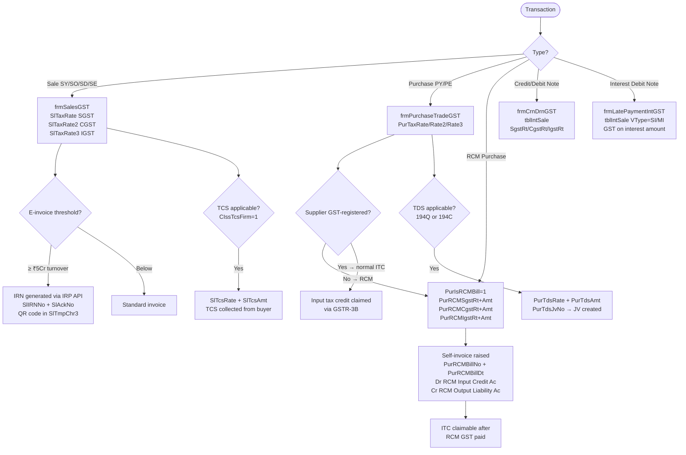

# GST Compliance

HITRIX V2 was built from the ground up for the GST era (post-July 2017). Every transaction table carries GST rate and amount columns; RCM, TDS, TCS, e-invoice IRN, and GSTR reconciliation are all handled within the core application.

---

## GST Rate Architecture

HITRIX stores CGST and SGST as **separate rate/amount fields** — not a single GST percentage — because inter-state (IGST) and intra-state (CGST+SGST) are mutually exclusive:

```
SlTaxRate   = SGST rate %     SlTaxAmt   = SGST amount
SlTaxRate2  = CGST rate %     SlTaxAmt2  = CGST amount
SlTaxRate3  = IGST rate %     SlTaxAmt3  = IGST amount
```

The same pattern is used on `tblPurch` (`PurTaxRate` / `PurTaxRate2` / `PurTaxRate3`) and `tblIntSale` (`SgstRt`/`SgstAmt`, `CgstRt`/`CgstAmt`, `IgstRt`/`IgstAmt`).

---

## Dual Rate per Item Type

Cotton and polyester/synthetic attract different GST rates. Both sets of rates live in a single row in `tblMastNarration WHERE Narration='G S T'`:

| Column | Description |
|---|---|
| `CotCGSTRt` / `CotSGSTRt` / `CotIGSTRt` | Cotton GST rates |
| `PolCGSTRt` / `PolSGSTRt` / `PolIGSTRt` | Polyester / synthetic rates |
| `CotCGSTAc` / `CotSGSTAc` / `CotIGSTAc` | Cotton GST ledger accounts |

Item type is read from `tblMastItem.ItItemType`. Rate selection at entry time:
- `ItItemType = 'C'` → cotton rates
- `ItItemType = 'P'` or other → polyester rates

---

## Intra / Inter State Detection

```
Buyer GSTIN prefix (first 2 digits) = buyer's state code
Firm GSTIN prefix (from tblMastCompany.CGSTIN) = firm's state code

If buyer state ≠ firm state → IGST applies (CGST = SGST = 0)
If same state             → CGST + SGST applies (IGST = 0)
```

This check runs at line-item level in `frmSalesGST` and at note level in `frmCrnDrnGST`.

---

## GST Flow by Transaction Type



---

## RCM (Reverse Charge Mechanism)

When a mill or supplier is **not GST-registered**, the buyer must self-account for GST:

```
PurIsRCMBill   = 1                 flag — RCM purchase
PurRCMBillNo                       self-invoice / challan number
PurRCMBillDt                       date of self-invoice
PurRCMSaleAc                       RCM output liability account
PurRCMCgstRt + PurRCMCgstAmt      CGST under RCM
PurRCMSgstRt + PurRCMSgstAmt      SGST under RCM
PurRCMIgstRt + PurRCMIgstAmt      IGST under RCM
```

The accounting entry generated:
```
Dr  RCM Input Credit A/C   (gSgstRCMRecCode / gCgstRCMRecCode / gIgstRCMRecCode from tblMastSetting)
Cr  RCM Output Liability A/C  (PurRCMSaleAc)
```

ITC under RCM is claimable only after the RCM GST amount is paid to the government (tracked separately in GSTR-3B).

---

## TCS on Sales (Section 206C)

`TCS` (Tax Collected at Source) applies when the buyer's cumulative purchase from the firm exceeds ₹50L in a year:

```
SlTcsOnAmt    — base amount for TCS
SlTcsRate     — TCS rate %
SlTcsAmt      — TCS amount collected
```

`tblMastCompany.CIssTcsFirm = 1` enables TCS for a firm. The TCS amount is added to the invoice total and remitted to government by the seller.

---

## TDS on Purchase (Sections 194Q / 194C)

TDS is deducted from the supplier payment when the firm's cumulative purchases from that party cross ₹50L (194Q) or for contract payments (194C):

```
PurTdsRate     — TDS %
PurTdsAmt      — TDS deducted
PurTdsOnAmt    — base amount (usually PurBillAmt)
PurTdsAC       — TDS payable account
PurTdsJvNo     — JV Vno created for the TDS entry
```

The form checks cumulative `PurBillAmt` for the party and year to determine threshold crossing. `tblMastAccount.AcIsLessTDSOnRec = 1` flags parties that require TDS on receipt.

---

## E-Invoice (IRN)

For firms with turnover ≥ ₹5 crore, every sale invoice requires an IRN from the IRP portal:

```
SlIRNNo      — Invoice Reference Number from IRP
SlAckNo      — Acknowledgement number
SlTmpChr3    — QR code string (embedded in invoice print)
```

The same fields exist on `tblIntSale` for credit/debit notes:
```
SlIRNNo / SlAckNo   — on tblIntSale rows (SV/SI/PV/PX)
```

Currently in HITRIX, IRN values are **imported from Excel** — the form updates the columns via `UPDATE` after the user pastes in the exported IRN file. There is no direct IRP API call from within the VB6 application.

---

## GST Accounts Configuration

All GST ledger accounts are read from two sources at login:

**`tblMastSetting`** (via `GProcGetSettingDetail`):

| Global variable | Purpose |
|---|---|
| `gSgstTaxRate` / `gCgstTaxRate` / `gIgstTaxRate` | Default rates |
| `gSgstAcCode` / `gCgstAcCode` / `gIgstAcCode` | Output GST accounts |
| `gSgstRCMRecCode` / `gCgstRCMRecCode` / `gIgstRCMRecCode` | RCM input accounts |
| `gTcsRec` / `gTcsPay` | TCS receivable / payable accounts |
| `gTdsOnPurchCode` / `gTdsOnSalesCode` | TDS accounts |

**`tblMastNarration WHERE Narration='G S T'`** (via `GProcGetGSTAccounts`):
- Cotton and polyester CGST/SGST/IGST rates and account codes
- These flow into every sale and purchase entry automatically

---

## GST Registers & Reports

All GST reports are generated by stored procedures that populate temp staging tables for Crystal Reports:

| Report | Stored Procedure | Source |
|---|---|---|
| Purchase GST register | `PrcPreparePurchaseGST` | `tblPurch` |
| Sale GST register | `PrcPrepareSaleGST` | `tblSale` |
| GSTR-2A reconciliation | `PrcPrepareGSTR2A` | `tblPurch` vs. portal data |
| GSTR-3B summary | Inline queries | Aggregated from tblSale/tblPurch |
| Capital goods ITC | `PrcPreparePurchaseGST` (filtered) | `PurIsCapitalGoods=1` |
| RCM register | Inline | `PurIsRCMBill=1` rows |

---

## Capital Goods ITC

`PurIsCapitalGoods = 1` on a purchase entry marks it as capital goods (machinery, equipment). Effect:
- ITC classification in GSTR-3B: 50% ITC claimable in year 1, 50% in year 2
- Separate line in the purchase GST register report

---

## Exempt Component (Cotton Levy)

Cotton purchases carry a non-GST levy (mandi tax / cotton cess). This is **outside GST** and tracked separately:

```
PurExemptAmt      — total exempt levy on the purchase
PurExemptPerKg    — exempt rate per kg
```

When the matching exempt sale (VType=`SE`) is entered, `PurExemptPerKg` flows into `SlExemptPerKg` on the sale line. `SlExemptAmt = SlExemptPerKg × SlSubWt` is recovered from the buyer and flows to the appropriate levy account — entirely outside the CGST/SGST/IGST ledgers.

---

## DhanMan Gaps

| Gap | Detail |
|---|---|
| RCM self-invoicing | `PurIsRCMBill` + self-invoice fields + ITC tracking — not in DhanMan |
| TDS on purchase (194Q/194C) | Threshold check, deduction, JV creation — not in DhanMan |
| TCS on sale (206C) | `SlTcsRate` / `SlTcsAmt` accumulation and remittance — not in DhanMan |
| E-invoice IRN integration | DhanMan document service needs direct IRP API calls (not Excel import) |
| Credit/debit note IRN | `tblIntSale.SlIRNNo/SlAckNo` — no DhanMan equivalent |
| Dual GST rate per item type | Cotton vs. polyester rate split at item level — DhanMan has single tax rate per item |
| Capital goods ITC flag | `PurIsCapitalGoods` for 50%/50% ITC split — not in DhanMan |
| Exempt component (cotton levy) | `PurExemptPerKg` → `SlExemptPerKg` flow — textile-specific, not in DhanMan |
| GSTR-2A reconciliation | `PrcPrepareGSTR2A` SP logic — no DhanMan equivalent |
| GST on late payment interest | Interest debit note with CGST/SGST/IGST + IRN — entirely absent |
