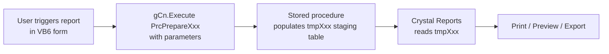

# Reporting & Stored Procedures

HITRIX generates all reports via **51 stored procedures** (`PrcPrepare*`) that populate Crystal Reports staging tables (`tmp*`). No report reads directly from transaction tables at print time — the procedure runs first, populates a temp table, and Crystal Reports binds to the temp table.

---

## Architecture



**Staging tables** (`tmp*`) are per-session or per-company temp tables. They are truncated at the start of each `PrcPrepare*` call and repopulated. This means reports are not re-entrant within the same connection — only one report of a given type can run at a time per company session.

---

## Stored Procedures by Domain

### Sales

| Procedure | Purpose | Key Source Tables |
|---|---|---|
| `PrcPrepareSaleGST` | Sale GST register — rate-wise summary for GSTR-1 | `tblSale`, `tblSaleSub` |
| `PrcPrepareSaleRegister` | Full sale register with party and item details | `tblSale`, `tblSaleSub` |
| `PrcPrepareSaleMillBill` | Mill bill (SM) sale register | `tblSale`, `tblSaleSub` |
| `PrcPrepareSaleMillBillSub` | Mill bill line-item detail | `tblSaleSub` |
| `PrcPrepareSaleSIT` | SIT (sale in transit) register | `tblSale`, `tblSitLrDetails` |
| `PrcPrepareGetPassWiseSale` | Gate-pass-wise sale report | `tblSale`, `tblGatePass` |
| `PrcPrepareSaleReturnReg` | Sales return (RY) register | `tblSale`, `tblSaleSub` |

### Purchase

| Procedure | Purpose | Key Source Tables |
|---|---|---|
| `PrcPreparePurchaseGST` | Purchase GST register — GSTR-3B input | `tblPurch`, `tblPurchSub` |
| `PrcPreparePurchaseRegister` | Full purchase register | `tblPurch`, `tblPurchSub` |
| `PrcPreparePurchaseSIT` | SIT purchase register | `tblPurch`, `tblSitLrDetails` |
| `PrcPreparePurchaseInward` | PI (goods inward) register with bag counts | `tblPurch`, `tblPurchSub`, `tblBags` |
| `PrcPreparePurchaseReturn` | Purchase return (VY) register | `tblPurch`, `tblPurchSub` |

### Booking & Despatch

| Procedure | Purpose | Key Source Tables |
|---|---|---|
| `PrcPreparePendingBookingParty` | Open bookings by party | `tblBooking` |
| `PrcPreparePendingBookingPurch` | Open bookings by purchase (mill-wise) | `tblBooking` |
| `PrcPreparePendingBookingMillBill` | Open mill bill bookings | `tblBooking` |
| `PrcPrepareBookingPartyVsDesp` | Booked vs. despatched comparison | `tblBooking`, `tblBooKingDesp` |

### Finance & Vouchers

| Procedure | Purpose | Key Source Tables |
|---|---|---|
| `PrcPrepareAccLedger` | Full account ledger (party / GST / trading) | `tblVoucher`, `tblSale`, `tblPurch`, `tblIntSale` |
| `PrcPrepareAccLedgerBrokSale` | Broker-wise sale ledger | `tblSale`, `tblVoucher` |
| `PrcPrepareBrokSale` | Brokerage sale summary | `tblSale` |
| `PrcPrepareClBalance` | Closing balance report by account | `tblVoucher` |
| `PrcPrepareDailyReport` | Daily transaction summary (all VTypes) | `tblSale`, `tblPurch`, `tblVoucher` |
| `PrcPrepareDailyReportMail` | Daily report formatted for email dispatch | Same as daily report |
| `PrcPrepareDailyEntryMillBill` | Daily mill bill entry report | `tblSale` SM type |
| `PrcPrepareOutStangingSale` | Outstanding bill popup in receipt form | `tblSale` |

### GST Compliance

| Procedure | Purpose | Key Source Tables |
|---|---|---|
| `PrcPrepareGSTR2A` | GSTR-2A reconciliation (purchase vs. portal) | `tblPurch`, portal import data |
| `PrcPreparePurchaseGST` | Purchase GST register with RCM and capital goods separation | `tblPurch` |
| `PrcPrepareSaleGST` | Sale GST register, rate-wise breakup | `tblSale` |

### Stock & Inventory

| Procedure | Purpose | Key Source Tables |
|---|---|---|
| `PrcPrepareStockLot` | Lot-wise stock position | `tblBags`, `tblPurch`, `tblSale` |
| `PrcPrepareStockGodown` | Godown-wise stock summary | `tblBags` |
| `PrcPrepareStockItem` | Item-wise stock summary | `tblPurchSub`, `tblSaleSub` |
| `PrcPrepareStockItemBag` | Item + bag-level stock detail | `tblBags` |
| `PrcPrepareGodownTransfer` | Godown transfer report | `tblPurch` PI/PR types |

### Interest & Credit Notes

| Procedure | Purpose | Key Source Tables |
|---|---|---|
| `PrcPrepareIntDbNote` | Interest debit note register | `tblIntSale` VType=SI/MI |
| `PrcPrepareCrnDrn` | Credit / debit note register (SV/PV/PX/SI) | `tblIntSale` |

### SIT (Sale/Purchase in Transit)

| Procedure | Purpose | Key Source Tables |
|---|---|---|
| `PrcPrepareSitRegister` | SIT transaction register | `tblSitLrDetails`, `tblSale`, `tblPurch` |
| `PrcPrepareSitLrPending` | Pending SIT lorry receipts | `tblSitLrDetails` |

### Profit & Loss / Balance Sheet

| Procedure | Purpose | Key Source Tables |
|---|---|---|
| `PrcPrepareProfitLoss` | Trading account + P&L | `tblSale`, `tblPurch`, `tblVoucher` |
| `PrcPrepareBalanceSheet` | Balance sheet with GST accounts | `tblVoucher`, `tblMastSetting` |
| `PrcPrepareTrialBalance` | Trial balance by account group | `tblVoucher` |

### Party & Broker Reports

| Procedure | Purpose | Key Source Tables |
|---|---|---|
| `PrcPreparePartyWiseSale` | Party-wise sale summary | `tblSale` |
| `PrcPreparePartyWisePurch` | Party-wise purchase summary | `tblPurch` |
| `PrcPrepareBrokerCommission` | Broker commission statement | `tblSale`, `tblMastAccount` |
| `PrcPrepareMillWiseSale` | Mill-wise sale analysis | `tblSale` |

### Gate Pass

| Procedure | Purpose | Key Source Tables |
|---|---|---|
| `PrcPrepareGatePass` | Gate pass register | `tblGatePass` |
| `PrcPrepareGatePassPending` | Open (unlinked) gate passes | `tblGatePass` |

---

## Stored Procedure Parameters (Common Pattern)

All `PrcPrepare*` procedures accept a standard set of parameters:

```sql
@VFirm    nvarchar(4)        -- company code filter
@VYear    int                -- financial year
@From_dt  smalldatetime      -- date range start
@To_dt    smalldatetime      -- date range end
-- plus domain-specific filters:
@AcCode   int                -- for party ledger
@ItCode   int                -- for item-specific reports
@Godown   int                -- for godown stock reports
```

The VB6 calling code follows the pattern:
```vb
gCn.Execute "EXEC PrcPrepare<Name> '" & gCCode & "', " & gCYear & ", '" & from & "', '" & toDate & "'"
```

---

## Crystal Reports Integration

| Crystal Reports Component | Usage |
|---|---|
| `Crystl32.OCX` | Legacy VB6 OCX control embedded in forms |
| `CRAXDRT` (Crystal ActiveX Designer Runtime) | Runtime print/preview/export |
| `.rpt` files | One `.rpt` file per report; linked to tmp* staging tables |
| Paper formats | A4, custom width for ledger/register reports |

Report files are stored alongside the VB6 source in `src/ABabu_Cd_15-05-2026/`. Each form that triggers a report calls `Crystl32.ReportSource = "<path>.rpt"` and then `Crystl32.PrintReport`.

---

## Key Staging Tables

| Staging Table | Used By |
|---|---|
| `tmpSale` | Sale register, GST register, party-wise |
| `tmpPurch` | Purchase register, GST register |
| `tmpAccLedger` | Account ledger |
| `tmpStock` | Stock reports |
| `tmpBooking` | Booking reports |
| `tmpDailyRpt` | Daily report |
| `tmpGSTR2A` | GSTR-2A reconciliation |
| `tmpIntSale` | Interest / credit-debit note reports |

---

## DhanMan Gaps

| Gap | Detail |
|---|---|
| No reporting engine | DhanMan has no Crystal Reports equivalent — reports must be rebuilt as API endpoints returning JSON, consumed by a React/charting frontend |
| 51 procedures to port | Each `PrcPrepare*` procedure logic must be translated to a DhanMan service query or report endpoint |
| Staging table pattern | The tmp* approach is SQL Server-specific; DhanMan should use on-demand queries or materialized views in PostgreSQL |
| GSTR-2A reconciliation | `PrcPrepareGSTR2A` compares internal purchase data with GST portal data — DhanMan needs a structured GSTR-2A import + diff service |
| Daily report email | `PrcPrepareDailyReportMail` currently feeds Crystal Reports + VB6 email — DhanMan should produce this via a scheduled background job |
| Booking vs. despatch report | `PrcPrepareBookingPartyVsDesp` is critical for day-to-day operations — must be a first-class report in the new system |
| Bag-level stock reports | `PrcPrepareStockLot` / `PrcPrepareStockItemBag` rely on `tblBags` — only available after bag-level tracking is implemented |
