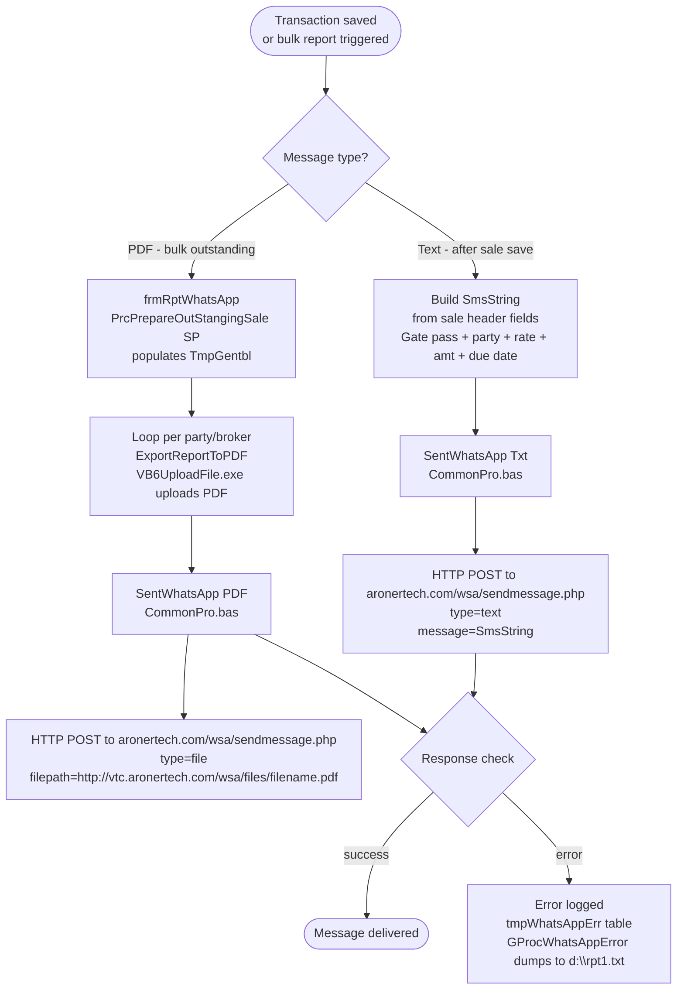

# WhatsApp Integration

HITRIX V2 sends WhatsApp messages directly from the ERP after key transaction events. Two delivery modes are supported: a **text message** sent immediately after saving a sale or booking, and a **PDF attachment** sent in bulk for outstanding bills. Both modes call a third-party WhatsApp gateway API.

---

## Architecture



---

## Gateway: AronerTech WhatsApp API

The integration calls a self-hosted or third-party WhatsApp gateway at `aronertech.com`. The API key and session token are hardcoded in `CommonPro.bas`:

```
Provider key : 4c934105f595a7d434c25db540594c987d779f02931bd5483fee580e710c31bd
Token        : 604b168066db2d2ff6c6f286
Endpoint     : http://aronertech.com/wsa/sendmessage.php
File host    : http://vtc.aronertech.com/wsa/files/<filename>.pdf
```

This is an unofficial WhatsApp Business gateway — not Meta's official Cloud API. It requires a WhatsApp session to be active on the server.

---

## SentWhatsApp Function (CommonPro.bas)

```vb
Public Function SentWhatsApp(WAMsgType As String, WAFile As String,
    WAMsg As String, ToMblNo As String, Optional wPartyName)
```

| Parameter | Description |
|---|---|
| `WAMsgType` | `"Txt"` for plain text, `"PDF"` for file attachment |
| `WAFile` | PDF filename (used for PDF mode only) |
| `WAMsg` | Message body (used for Txt mode only) |
| `ToMblNo` | Recipient mobile number (10 digits, India) |
| `wPartyName` | Optional — party name for error logging |

**Text message flow:**
```
params = "key=<key>&token=<token>&number=<mobile>&type=text&message=<body>"
HTTP POST → aronertech.com/wsa/sendmessage.php
```

**PDF attachment flow:**
1. Crystal Reports exports the report to a local PDF: `gReportPath\<timestamp>.pdf`
2. `VB6UploadFile.exe` uploads the PDF to `vtc.aronertech.com/wsa/files/`
3. HTTP POST sends the file URL to the recipient:
```
params = "key=<key>&token=<token>&number=<mobile>&type=file&filepath=http://vtc.aronertech.com/wsa/files/<filename>.pdf"
```

The function retries up to 3 times if the response contains `"10-Download file failed"` or `"02-Client id not found"`.

---

## Mobile Number Lookup

Mobile numbers come from `tblMastAccount.AcContNo` (varchar 50 — the general contact number field). Forms look it up just before sending:

```vb
SmsMblNo = GProcGetColumnValue("TblMastAccount", "ACName", txtTemp(5), "S", "AcContNo", "S")
```

If `AcContNo` is blank, a message box shows "Party Mobile No Not Found" and no WhatsApp is sent. The first 10 characters (`Left(ToMblNo, 10)`) are used as the number — any extension or ISD prefix is stripped.

`tblMastAccount` also has a separate `AcMblNoSMS` column (varchar 15) which appears to have been an older SMS field. The live WhatsApp code uses `AcContNo`.

---

## Trigger Points

### 1. After Sale Save (frmSalesGST) — Text Message

Triggered by a "Whatsapp SMS PDF" button on the form toolbar (`cmdBtn` with Caption = "Whatsapp SMS PDF"`). The button sends a text message (not a PDF) to both the **party** and the **broker**:

**Message format built in code:**

```
Firm   :
*<FIRM NAME>*

*GATE PASS*

No     : *<gate_pass_no>*
Date  : <date>

Party  : *<party_name>*

Broker : <broker_name>
Mill   : <item_count>

Count  :
*<yarn_count>*

Qty.      : <bags>
Weight : <weight> Kgs
Rate     : *<rate>* / <unit> Kgs
( Plus GST and TCS )

Amount : *<bill_amount>*

*Due Date  : <due_date>*
```

Recipients: `AcContNo` of the party + `AcContNo` of the broker. Both get the same message.

### 2. After Booking Save (frmBookingParty / frmBookingMillBill / frmBookingTradeGST) — Text Message

Same `SentWhatsApp "Txt"` pattern as the sale. The booking form sends the booking confirmation details (party, item, qty, rate) to both the party and the broker immediately after save. The booking confirmation PDF (PDF mode) is commented out in the current code — only text mode is active.

### 3. Bulk Outstanding — PDF via frmRptWhatsApp

Accessible from the main menu under "Whatsapp Message". Sends outstanding bill statements to all parties or all brokers in one batch:

**Mode: "Outsading To Party"**
1. Calls `PrcPrepareOutStangingSale` SP → populates `TmpGentbl`
2. Loops through each distinct party in `TmpGentbl`
3. Generates a Crystal Reports PDF: `rptOutstPartywiseWhatsApp.rpt`
4. Uploads via `VB6UploadFile.exe` → `SentWhatsApp "PDF"`
5. Reports progress every 25 sends (MsgBox)

**Mode: "Outsading To Broker"**
Same flow but grouped by broker and uses `rptOutstBrokerwiseWhatsApp.rpt`

**Date filter:** "Due Bills" (radio button `OptBills(1)`) or "All Bills" — maps to stored procedure parameter `@DueOn = 'D'` or `'B'`.

**From Party/Broker Code filter:** Can skip parties/brokers up to a starting code (for resuming a partial batch).

### 4. Bank Detail Mail — Email (not WhatsApp)

The "Bank Detail Mail" option in the same `frmRptWhatsApp` form sends a static **email** (not WhatsApp) warning about cyber fraud / bank account change scams. This calls `SendEmail1` with a hardcoded message body addressed to all debtors (`AgCode = 90017`). Despite the form name, this mode uses SMTP, not WhatsApp.

---

## Error Handling

Failed sends are logged to `tmpWhatsAppErr` (staging table):

| Column | Description |
|---|---|
| `VFirm` | Firm code |
| `Mbl1` | Primary mobile number attempted |
| `Mbl2` | Secondary mobile (if any) |
| `PartyName` | Party name for identification |
| `Error` | API response text (up to 255 chars) |
| `USERNAME` | User who triggered the send |

After each batch, `GProcWhatsAppError` checks this table and if errors exist, writes them to `d:\rpt1.txt` and opens it in WordPad. The error logging to `tmpWhatsAppErr` via SQL `INSERT` is currently **commented out** in `SentWhatsApp` — only the text file dump is active.

Known API error codes seen in the code:
```
"04-Phone number not registered on whatsapp or your instance not connected"
"10-Download file failed"
"02-Client id not found"
```

---

## Key Limitations (HITRIX Implementation)

| Limitation | Detail |
|---|---|
| Hardcoded API credentials | Token and key are embedded in `CommonPro.bas` — not configurable per firm |
| Unofficial gateway | `aronertech.com` is not Meta's official WhatsApp Business API — subject to blocking |
| 10-digit number only | `Left(ToMblNo, 10)` strips any country code or extension |
| No delivery confirmation stored | API response is checked in-memory but not persisted (INSERT to tmpWhatsAppErr is commented out) |
| VB6UploadFile.exe dependency | PDF sending requires a separate executable in the app directory |
| PDF file naming | Uses `Format(Now, "ddMMyyyyhhmmss") & ".pdf"` — timestamp-based, no party reference in filename |
| Delay between sends | `delay(3)` — a 3-second busy-wait between each PDF send to avoid overloading the gateway |
| No scheduled/background send | All sends are synchronous and block the UI |

---

## DhanMan Implementation Guidance

| Feature | Recommended Approach |
|---|---|
| WhatsApp API | Use Meta's official WhatsApp Business Cloud API (v17+) — no third-party gateway dependency |
| Mobile number field | Add `whatsappNumber` to the party entity; validate format (E.164) at entry time |
| Post-save notification | Event-driven: publish a `SaleCreated` / `BookingCreated` event; a notification service subscribes and sends the WhatsApp |
| Message template | Register approved message templates with Meta (required for business-initiated messages); the gate pass format in HITRIX is a good starting template |
| Bulk outstanding | Background job: query unpaid bills, generate PDF statements, send via WhatsApp Business API batch endpoint |
| Delivery status | Store `messageId` from API response on the transaction record; webhook callback updates delivery status |
| Error handling | Retry queue with exponential backoff; dead-letter queue for persistently failed sends |
| Credentials | Per-company WhatsApp Business Account configuration — not hardcoded |
